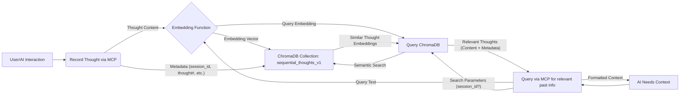
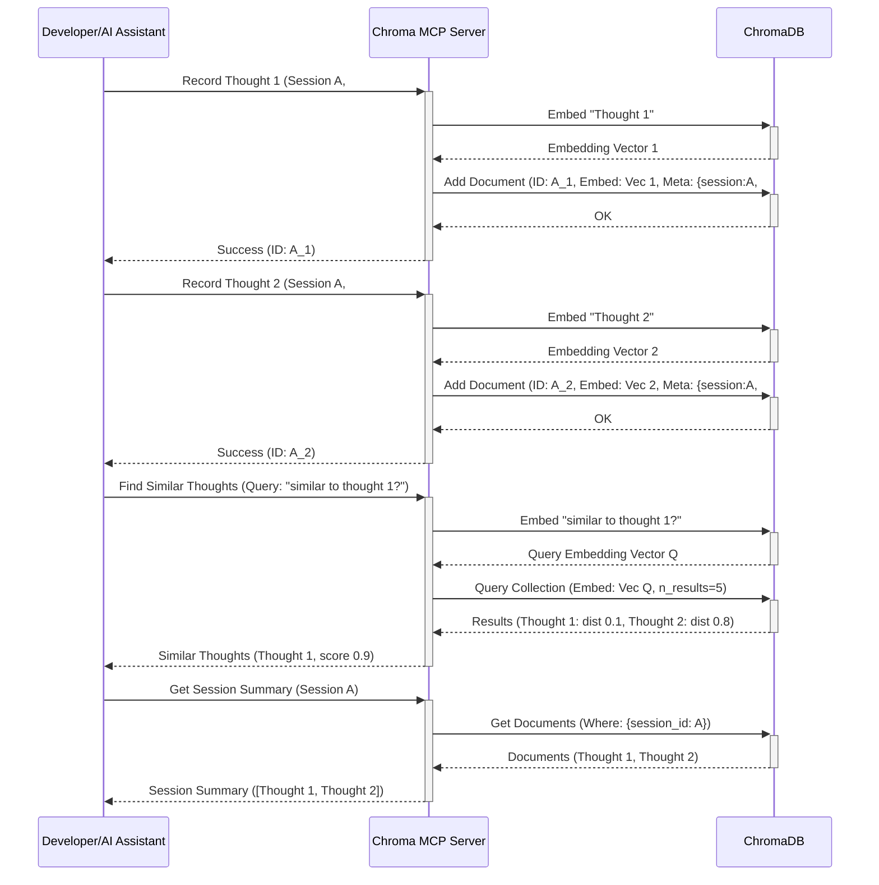

# Embeddings and Thinking Tools Guide

This guide explains the "Thinking Tools" provided by the Chroma MCP Server and how they leverage embeddings to create a persistent, searchable working memory for AI development workflows.

## Motivation: The Need for Working Memory

When collaborating with AI assistants like Cursor over extended periods or multiple sessions, maintaining context is a significant challenge. Key decisions, discovered code snippets, debugging insights, or temporary plans often get lost between interactions. Developers manually copy-paste context or create temporary files, which is inefficient.

The Chroma MCP Server addresses this with "Thinking Tools" designed to build a **Working Memory** specifically for the AI development process.

## Core Idea: Sequential Thoughts

The central concept is the **Sequential Thought**. This represents a single, discrete step or piece of information captured during a development session. Examples include:

- A specific user instruction (`Implement function X`)
- An AI's proposed plan (`1. Read file Y. 2. Modify class Z.`)
- A code snippet generated by the AI
- An error message encountered during testing
- A summary of a successful refactoring
- A key decision made (`Decided to use library A instead of B`)

These thoughts are stored chronologically within a **Thinking Session**, identified by a unique `session_id`.

## How Embeddings Power the Working Memory

Each recorded thought is automatically embedded into a vector representation by the configured embedding function (e.g., `default`, `accurate`, `openai`). These embeddings capture the semantic meaning of the thought's content.

- **Storage:** Thoughts and their embeddings are stored in a dedicated ChromaDB collection (`sequential_thoughts_v1`).
- **Retrieval:** When an AI assistant needs context from the past, it doesn't rely on simple keyword matching. Instead, it uses the `find_similar_thoughts` tool. This tool takes a query (e.g., "What was the plan for refactoring the database module?") and performs a **semantic search** against the stored thought embeddings.
- **Semantic Search:** ChromaDB finds thoughts whose embeddings are *semantically closest* to the query's embedding, even if the exact wording differs. This allows retrieving relevant past thoughts, plans, or code snippets based on their meaning, not just keywords.

## The Thinking Tools (`thinking_tools.py`)

These tools provide the interface to manage the working memory.

### 1. Recording Thoughts

- **`mcp_chroma_test_chroma_sequential_thinking`**: Records a single thought.
  - **Key Params:** `thought` (content), `thought_number`, `total_thoughts`, `session_id` (optional, generated if empty).
  - **Functionality:** Embeds the `thought` content and stores it along with metadata (session, sequence number, timestamp) in the `sequential_thoughts_v1` collection. Returns the `session_id` and generated `thought_id`.
- **Branches:** Allows creating alternative thought sequences within a session using `branch_id` and `branch_from_thought`.

### 2. Retrieving Thoughts (Semantic Search)

- **`mcp_chroma_test_chroma_find_similar_thoughts`**: Finds thoughts semantically similar to a query.
  - **Key Params:** `query` (text to search for), `session_id` (optional filter), `n_results`, `threshold` (similarity cutoff), `include_branches`.
  - **Functionality:** Embeds the `query`, searches the `sequential_thoughts_v1` collection for thoughts with similar embeddings (within the optional session and branch constraints), filters by the similarity `threshold`, and returns the matching thoughts (content, metadata, similarity score).

### 3. Retrieving Sessions

- **`mcp_chroma_test_chroma_get_session_summary`**: Retrieves all thoughts recorded for a specific `session_id`.
  - **Key Params:** `session_id`, `include_branches`.
  - **Functionality:** Fetches all thoughts matching the `session_id` (optionally filtering branches), sorts them by `thought_number`, and returns the complete sequence.
- **`mcp_chroma_test_chroma_find_similar_sessions`**: Finds sessions whose overall content is semantically similar to a query.
  - **Key Params:** `query`, `n_results`, `threshold`.
  - **Functionality:** (Requires pre-computation or a separate `thinking_sessions` collection). Embeds the `query` and searches for sessions (represented by aggregated embeddings or summaries stored separately) that are semantically similar. Returns matching `session_id`s and similarity scores.

## Use Cases

- **Context Recall:** "What did we decide about the error handling for function X yesterday?" -> `find_similar_thoughts`
- **Plan Retrieval:** "Show me the plan we made for implementing feature Y." -> `find_similar_thoughts` or `get_session_summary`
- **Code Snippet Search:** "Find the code snippet where we handled database connections." -> `find_similar_thoughts`
- **Session Review:** "Summarize the key steps taken in session Z." -> `get_session_summary`
- **Cross-Session Learning:** "Find other sessions where we discussed authentication." -> `find_similar_sessions` (if implemented)

By using these tools, AI assistants can maintain a more continuous understanding of the development process, leading to more relevant suggestions, fewer repeated questions, and a smoother workflow for the developer.
