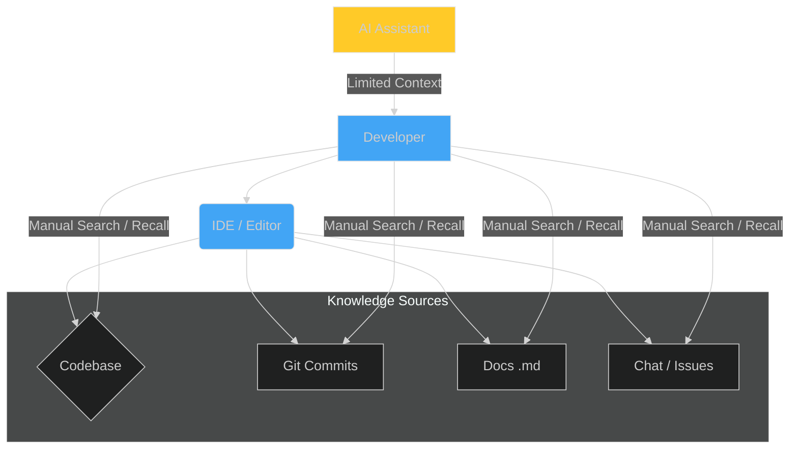
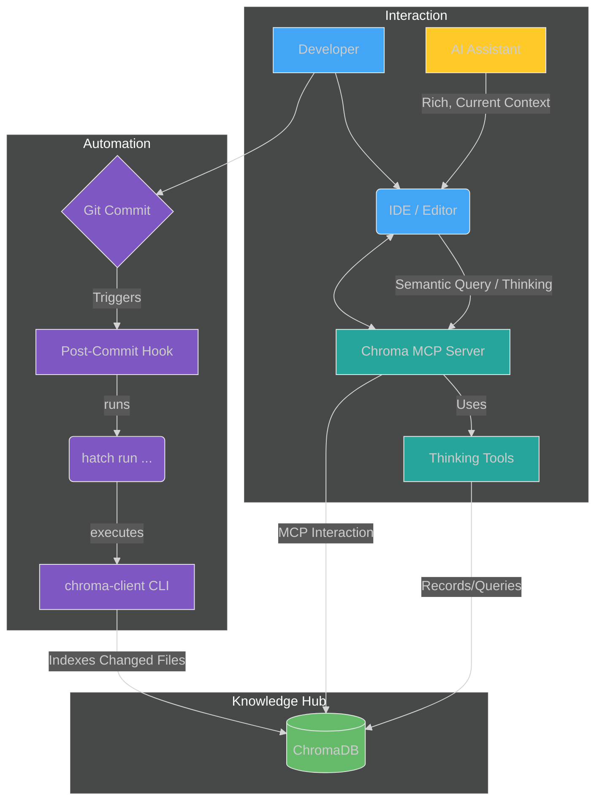

# Why Every Developer Needs Chroma MCP Server: Getting started with your "Second Brain"

## Introduction: The Scattered Knowledge Problem

Modern software projects generate a wealth of knowledge: design decisions, bug fixes, best practices, architectural notes, and lessons learned. Yet, traditionally, this crucial information gets scattered across markdown files, code comments, commit messages, chat logs, and issue trackers. Retrieving the right piece of context when needed often involves tedious manual searching (grep, Ctrl+F, digging through history), hindering productivity and increasing the risk of repeating past mistakes.

**Chroma MCP Server and its ecosystem** offer a transformative solution: an integrated, persistent, semantically searchable knowledge base built directly into your development workflow. This document explains the unique value proposition and how this ecosystem acts as a powerful "second brain" for developers and AI assistants alike.

## Development Cycles Compared

### Traditional Workflow: Scattered Knowledge & Manual Search

*Fig 1: Knowledge is fragmented, requiring manual effort for context retrieval.*

### Improved Workflow: Integrated Knowledge with Chroma MCP Ecosystem

*Fig 2: Automated indexing and interactive tools create a unified, always-current knowledge hub.*

## The Chroma MCP Ecosystem: Components

This enhanced workflow is powered by:

1. **Chroma MCP Server:** The central hub for *interactive* tasks, communicating via the Model Context Protocol (MCP). Used by IDEs and AI assistants for querying, feedback, and thinking tools.
2. **`chroma-mcp-client` CLI:** A command-line interface for *automated* tasks, primarily codebase indexing. It interacts directly with ChromaDB based on `.env` settings.
3. **Git Post-Commit Hook:** An automated script (set up by the developer) that triggers the `chroma-mcp-client` CLI to index changed files immediately after each commit.
4. **Thinking Utilities:** Python tools and MCP commands for capturing and retrieving structured thought processes (sequential or branching) within ChromaDB, accessible via the MCP Server.

## Unique Selling Proposition (USP): The Integrated "Second Brain"

The core value of the Chroma MCP Server ecosystem lies in its **unified and automated approach to creating a persistent, semantically searchable, and context-aware knowledge base directly integrated into the developer's natural workflow.**

Unlike using ChromaDB standalone or relying solely on manual documentation, this ecosystem provides:

1. **Automated Context Freshness:** The Git hook ensures the knowledge base (specifically the codebase index) reflects the *latest committed state* automatically, without requiring developers to remember to run indexing manually.
2. **Seamless Workflow Integration:** Knowledge capture (via commit hook indexing, thinking tools) and retrieval (via interactive MCP queries) happen within the developer's existing tools (Git, IDE).
3. **Hybrid Access Model:** Supports both background automation (direct client CLI for indexing) and interactive use (MCP server for AI/IDE queries, thinking, feedback), using the *same* underlying ChromaDB data store and configuration.
4. **Structured Reasoning Capture:** The Thinking Utilities offer a dedicated mechanism to store not just *what* the code is, but the *why* and *how* behind development decisions, queryable semantically.
5. **Enhanced AI Collaboration:** Provides AI assistants (like Cursor, etc.) with reliable, up-to-date, and semantically rich context derived directly from the evolving codebase and developer thoughts, leading to more accurate and relevant AI responses.

## Key Benefits

### For AI / RAG Accuracy & Reliability

* **Up-to-Date Context:** AI assistants query a knowledge base that is automatically synchronized with the latest code changes via the commit hook.
* **Reduced Hallucinations:** Providing current, accurate context minimizes the chance of AI generating code or explanations based on outdated information.
* **Improved Relevance:** Semantic search over the indexed codebase and structured thoughts delivers highly relevant snippets for AI prompts.
* **Reliable Automation:** The Git hook ensures indexing happens consistently after every commit.

### For Developer Productivity & Workflow

* **Instant, Current Context:** Developers can query the MCP server (via IDE) to retrieve relevant code snippets, design patterns, or past solutions reflecting the latest commit.
* **Effortless Indexing:** Eliminates the need for manual indexing commands; knowledge base stays current automatically.
* **Faster Debugging:** Semantically query for past errors or solutions ("how did we fix timeout errors in service X?").
* **Enhanced Onboarding:** New team members can query the history and reasoning captured in the knowledge base.
* **Structured Knowledge Capture:** Thinking tools encourage capturing design rationale and complex thought processes in a retrievable format.

## Leveraging the Ecosystem in Your Project

1. **Setup:** Configure your `.env`, install `chroma-mcp-server[client]`, and set up the `post-commit` hook (see [Automating Codebase Indexing with Git Hooks](./automation/git_hooks.md)).
2. **Commit:** As you develop, commit your changes as usual. The hook automatically indexes added/modified files in the background.
3. **Query:** When needing context, use your IDE's MCP integration to query the `chroma-mcp-server` (e.g., `chroma_query_documents "search term"`). The results will reflect the code indexed up to your last commit.
4. **Think:** Use the Thinking Utilities (via MCP tools or potentially IDE shortcuts calling `record-thought`) to capture complex reasoning, decisions, or alternative approaches during development. Query these later using `chroma_find_similar_thoughts`.
5. **Feedback (Optional):** Implement feedback mechanisms to refine RAG results further.

## Trade-offs and Considerations

* **Initial Setup:** Requires setting up the `.env` file, installing dependencies (`hatch`, `chroma-mcp-server[client]`), and configuring the Git hook script in each developer's local clone.
* **Dependency:** The hook relies on `hatch` being installed and accessible in the PATH where `git commit` is run.
* **Commit Overhead:** The post-commit hook adds a small delay to each commit while indexing occurs (usually minimal for incremental changes).
* **Discipline:** The value of Thinking/Feedback tools depends on developers consistently using them to capture knowledge.
* **Storage:** The ChromaDB database will grow over time, consuming disk space.

## Conclusion: Your Project's Living Memory

The Chroma MCP Server ecosystem, particularly when combined with automated Git hook indexing, transforms your project's knowledge from scattered artifacts into a dynamic, integrated, and always-current "second brain". It enhances both developer productivity and AI collaboration by ensuring that context retrieval is effortless, accurate, and reflects the true state of your work. By automating the crucial step of keeping the knowledge base synchronized with code changes, it unlocks the full potential of semantic search and RAG within the development lifecycle.

---

*For setup and API usage, see the main README and API reference in this docs directory.*
