# Why Every Developer Needs Chroma MCP Server: Getting started with your "Second Brain"

## Introduction: The Scattered Knowledge Problem

Modern software projects generate a wealth of knowledge: design decisions, bug fixes, best practices, architectural notes, and lessons learned. Yet, traditionally, this crucial information gets scattered across markdown files, code comments, commit messages, chat logs, and issue trackers. Retrieving the right piece of context when needed often involves tedious manual searching (grep, Ctrl+F, digging through history), hindering productivity and increasing the risk of repeating past mistakes.

**Chroma MCP Server and its ecosystem** offer a transformative solution: an integrated, persistent, semantically searchable, and *evolving* knowledge base built directly into your development workflow. This document explains the unique value proposition and how this ecosystem acts as a powerful "second brain" for developers and AI assistants alike, especially when following the evolutionary path laid out in our [local_rag_pipeline_plan_v4.md](refactoring/local_rag_pipeline_plan_v4.md).

**Current Implementation Status:** The "Second Brain" concept is being implemented through a phased approach defined in [local_rag_pipeline_plan_v4.md](refactoring/local_rag_pipeline_plan_v4.md). The foundational capabilities outlined in Phase 1 have been largely implemented, including:

- ✓ Automated code indexing with semantic code chunking
- ✓ Enhanced chat logging with rich context capture (code diffs, tool sequences)
- ✓ Bidirectional linking between code and discussions
- ✓ Working memory tools
- ✓ Basic derived learnings promotion

**Recently Enhanced Plan:** The implementation plan has been upgraded to include:

- ⚙️ **Test Result Integration** (Planned): Capturing, storing and analyzing test execution results in a new `test_results_v1` collection to provide concrete metrics for measuring code quality improvements.
- ⚙️ **ROI Measurement Strategy** (Planned): A comprehensive framework for measuring development efficiency, code quality impact, developer experience, and business value using concrete metrics.
- ⚙️ **Critical Metadata Enhancements** (Planned): Mandatory tagging, categorization, model version tracking, and metrics collection to enable quantitative measurement of RAG effectiveness.

The CLI tools (`analyze_chat_history.sh`, `promote_learning.sh`, `review_and_promote.sh`) are currently being enhanced to fully leverage the rich metadata captured. The more advanced features involving automated analysis, LoRA fine-tuning (Phase 2), and the full automated reinforcement learning pipeline (Phase 3) are under active development.

## Development Cycles Compared

### Traditional Workflow: Scattered Knowledge & Manual Search

*Fig 1: Traditional workflow - Knowledge is fragmented, context for AI is often stale, and retrieval is a manual, time-consuming chore.*


📋 View mermaid source code

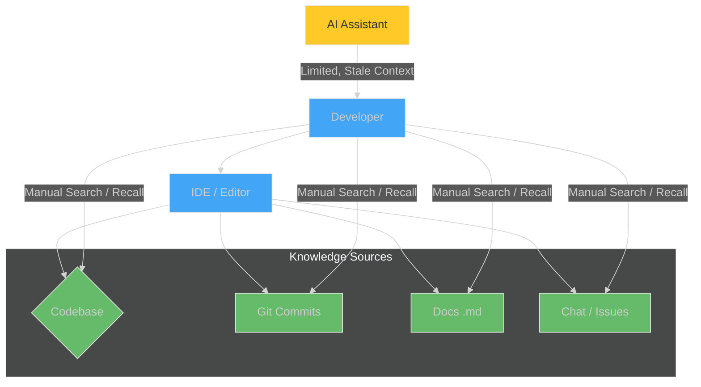

### Improved Workflow: Integrated, Evolving Knowledge with Chroma MCP Ecosystem (v4 Plan)

*Fig 2: The Chroma MCP ecosystem - Automated indexing, enhanced chat logging with context capture, bidirectional linking, test result integration, ROI measurement, and a phased learning loop create a unified, always-current, and evolving knowledge hub.*


📋 View mermaid source code

```mermaid
%%{init: {'theme': 'dark'}}%%
graph TD
    A[Developer] --> B(IDE / Editor);
    B <--> C[Chroma MCP Server];
    A --> D{Git Commit};
    D -- Triggers --> E[Post-Commit Hook];
    E -- runs --> F(hatch run ...);
    F -- executes --> G[chroma-mcp-client CLI];
    G -- Indexes Changed Files --> H[(ChromaDB: codebase_v1)];
    C -- MCP Interaction --> H;
    
    subgraph "AI Interaction & Learning Loop (v4)"
        K[AI Assistant] -- Extracts Code Context, Tools, Diffs --> L[auto_log_chat Rule];
        L -- MCP Call --> C;
        C -- Stores Summaries, Context --> M[(ChromaDB: chat_history_v1)];
        C -- Updates Links --> H;
        N[Developer/Automated Process] -- Promotes/Analyzes --> O[(ChromaDB: derived_learnings_v1)];
        C -- RAG Queries --> H;
        C -- RAG Queries --> M;
        C -- RAG Queries --> O;
        P[LoRA Training Phase 2/3] -- Uses Data From --> M;
        P -- Uses Data From --> O;
        C -- Optionally Uses --> Q[LoRA Adapter];
    end

    I[Thinking Tools] -- Records/Queries --> TS1;
    B -- Semantic Query / Thinking / AI Interaction --> C;
    K -- Rich, Current, Evolving Context --> B;

    subgraph "Measurement & Quality Loop (Planned)"
        R[Test Execution] -- Generates JUnit XML --> S[log-test-results CLI];
        S -- Stores Results --> T;
        C -- Stores Results --> T[(ChromaDB: test_results_v1)];
        C -- Updates Code Links --> H;
        C -- Updates Chat Links --> M;
        U[Metrics Dashboard] -- Analyzes Results --> T;
        U -- Tracks Quality Trends --> H;
        U -- Tracks Discussion Impact --> M;
        U -- Evaluates Pattern Effectiveness --> O;
        U -- Generates ROI Reports --> A;
    end

    subgraph "Knowledge Hub (ChromaDB)"
        direction LR
        H
        M
        O
        T
        TS1[(ChromaDB: thinking_sessions_v1)]
    end
    subgraph Automation
        D
        E
        F
        G
    end
    subgraph Interaction
        A
        B
        C
        I
        K
    end
    subgraph "Learning & Adaptation (v4)"
        L
        N
        P
        Q
    end

    style A fill:#42A5F5,stroke:#E6E6E6,stroke-width:1px
    style B fill:#42A5F5,stroke:#E6E6E6,stroke-width:1px
    style K fill:#FFCA28,stroke:#E6E6E6,stroke-width:1px,color:#333333
    style H fill:#66BB6A,stroke:#E6E6E6,stroke-width:1px
    style M fill:#66BB6A,stroke:#E6E6E6,stroke-width:1px
    style O fill:#66BB6A,stroke:#E6E6E6,stroke-width:1px
    style T fill:#66BB6A,stroke:#E6E6E6,stroke-width:1px
    style TS1 fill:#66BB6A,stroke:#E6E6E6,stroke-width:1px
    style C fill:#26A69A,stroke:#E6E6E6,stroke-width:1px
    style I fill:#26A69A,stroke:#E6E6E6,stroke-width:1px
    style D fill:#7E57C2,stroke:#E6E6E6,stroke-width:1px
    style E fill:#7E57C2,stroke:#E6E6E6,stroke-width:1px
    style F fill:#7E57C2,stroke:#E6E6E6,stroke-width:1px
    style G fill:#7E57C2,stroke:#E6E6E6,stroke-width:1px
    style L fill:#AB47BC,stroke:#E6E6E6,stroke-width:1px
    style N fill:#AB47BC,stroke:#E6E6E6,stroke-width:1px
    style P fill:#D4E157,stroke:#E6E6E6,stroke-width:1px,color:#333333
    style Q fill:#D4E157,stroke:#E6E6E6,stroke-width:1px,color:#333333
    style R fill:#FF8A65,stroke:#E6E6E6,stroke-width:1px
    style S fill:#FF8A65,stroke:#E6E6E6,stroke-width:1px
    style U fill:#FF8A65,stroke:#E6E6E6,stroke-width:1px
```

## The Chroma MCP Ecosystem: Components

This enhanced workflow is powered by:

1. **Chroma MCP Server:** The central hub for *interactive* tasks, communicating via the Model Context Protocol (MCP). Used by IDEs and AI assistants for querying, feedback, and thinking tools. It serves as the gateway to the ChromaDB knowledge hub.
2. **`chroma-mcp-client` CLI:** A command-line interface for *automated* tasks, primarily codebase indexing into `codebase_v1`. It interacts directly with ChromaDB based on `.env` settings.
3. **Git Post-Commit Hook:** An **automated script** that **automatically triggers** the `chroma-mcp-client` CLI to index changed files into `codebase_v1` immediately after each commit.
4. **Thinking Utilities:** Python tools and MCP commands for capturing and retrieving structured thought processes (e.g., into `thinking_sessions_v1`) within ChromaDB, accessible via the MCP Server.
5. **Automated Chat Logging Rule (`auto_log_chat`):** An **IDE rule** that **automatically instructs** the AI assistant to summarize and log chat interactions to the `chat_history_v1` collection in ChromaDB via MCP calls after each response. The enhanced implementation now captures:
   - Code context (before/after snippets) when edits are made
   - Diff summaries showing specific changes
   - Tool sequence patterns (e.g., read_file→edit_file→run_terminal_cmd)
   - Confidence scores for evaluating interaction quality
   - Bidirectional linking with modified code files
6. **ChromaDB Collections:** The persistent store for:
    - `codebase_v1`: Up-to-the-minute indexed code with semantic chunking and bidirectional links.
    - `chat_history_v1`: A rich log of AI-developer dialogues with enhanced context capture.
    - `derived_learnings_v1`: Curated, high-quality insights and validated solutions promoted from chat history or other sources.
    - `thinking_sessions_v1`: Developer's structured thoughts and reasoning.
    - `test_results_v1` (Planned): Structured test execution results with bidirectional links to code and discussions, enabling concrete measurement of code quality improvements over time.
7. **CLI Tools for Review & Promotion:**
    - `analyze-chat-history`: Analyzes entries in `chat_history_v1` (being enhanced to use rich context metadata).
    - `promote-learning`: Creates entries in `derived_learnings_v1` from analyzed chats.
    - `review-and-promote`: Interactive interface for reviewing and promoting candidate learnings.
    - `log-test-results` (Planned): Processes JUnit XML output from test runs and stores structured test results in `test_results_v1` with bidirectional links to code and discussions.
8. **(Phases 2 & 3) Learning Pipeline Components:** Scripts and processes for exporting reward datasets (`rl_dataset_*.jsonl`), training LoRA adapters (`lora_codelearn_*.safetensors`), and automating this cycle.

## Unique Selling Proposition (USP): The Integrated, Evolving "Second Brain"

The traditional development workflow forces developers to be digital archaeologists, constantly digging through scattered, often outdated, fragments of information. AI assistants in such environments operate with one hand tied behind their back, lacking deep, current project context. The Chroma MCP Server ecosystem, as envisioned in the [local_rag_pipeline_plan_v4.md](refactoring/local_rag_pipeline_plan_v4.md), offers a radical improvement: **a unified, automated, and evolving "Second Brain" that grows with your project and actively enhances both developer and AI performance.**

**How is it Different and Why is it Better?**

1. **Automated Contextual Foundation with Enhanced Capture (Solves Fragmentation & Staleness - Phase 1 implemented):**
    - **Traditional Pain:** Manually searching through Git logs, code comments, separate doc files, and endless chat histories. AI suggestions are generic or based on incomplete snippets you feed it.
    - **Chroma MCP Solution & WHY it's better:**
        - **Code (`codebase_v1`):** The Git hook **automatically indexes every change on commit** using semantic chunking that preserves logical code structures. Your codebase context is *always fresh* without a single manual indexing command.

          - **HOW:** `chroma-mcp-client index --changed` runs silently in the background using semantic code boundaries.
        - **Dialogues (`chat_history_v1`):** The enhanced `auto_log_chat` rule **automatically captures the essence of every AI interaction plus rich contextual information** (code diffs, tool sequences, confidence scores). No more "Where did we discuss that bug?" – it's logged, linked to related code changes, and semantically searchable.

          - **HOW:** AI extracts context, generates diffs, tracks tool usage, and calls an MCP tool.
        - **Bidirectional Linking:** Code changes and discussions are automatically connected, allowing you to trace feature evolution across both domains.
        - This automated context capture alone is a massive productivity boost over manual methods.

2. **Unified & Semantically Searchable Knowledge Hub (Solves Scattered Information - Phase 1 implemented):**
    - **Traditional Pain:** Information silos. Code is in the repo, design docs elsewhere, quick fixes in chat, error solutions in commit messages. Finding related pieces is a nightmare.
    - **Chroma MCP Solution & WHY it's better:** `codebase_v1`, `chat_history_v1`, `derived_learnings_v1`, and `thinking_sessions_v1` all reside in ChromaDB, accessible via the same semantic search capabilities. You can ask "Show me code related to X AND discussions where we fixed Y using X." With bidirectional linking, you can then navigate from code to related discussions or from discussions to affected code.

      - **HOW:** MCP tools query across these collections, providing multifaceted context and leveraging connection metadata.

3. **Explicit Knowledge Curation & Refinement (Empowers Precision - Phase 1 implemented):**
    - **Traditional Pain:** Tacit knowledge is lost. Useful snippets from chats or temporary solutions are forgotten. No easy way to flag "this is a golden solution."
    - **Chroma MCP Solution & WHY it's better:** The `derived_learnings_v1` collection allows developers to **explicitly promote and structure validated solutions and best practices.** This curated knowledge becomes a high-signal resource for both humans and AI, significantly boosting RAG quality. The `review-and-promote` tool provides a streamlined interface for reviewing and approving candidate learnings.

      - **HOW:** `promote-learning` CLI or interactive `review-and-promote` creates structured entries in `derived_learnings_v1` with linkages to source discussions and code.

4. **Evolutionary Learning & Adaptation (Transforms AI from Tool to Partner - Phases 2 & 3 in development):**
    - **Traditional Pain:** AI assistants are static tools. They don't learn from your project's specific nuances, coding style, or past corrections beyond the immediate conversation.
    - **Chroma MCP Solution & WHY it's better:**
        - **Phase 2 (Optional LoRA - In Development):** Developers can **manually fine-tune LoRA adapters** using high-quality data from `chat_history_v1` / `derived_learnings_v1`. This allows AI to be *specialized* for specific, recurring project tasks.

          - **HOW:** Export reward data, train LoRA, use on-demand in IDE.

        - **Phase 3 (Automated RL - In Development):** The system **automatically analyzes interactions, generates training data, and retrains LoRA models.** The "Second Brain" doesn't just store information; it *learns and adapts*, continuously improving its understanding and the relevance of its suggestions.

          - **HOW:** Scheduled scripts automate the analysis, training, and deployment cycle.

        - **This makes the AI a continuously improving partner that understands your project's evolving context deeply.**

5. **Seamless Workflow Integration (Reduces Friction - All Phases):**
    - **Traditional Pain:** Constantly switching contexts, copying-pasting, manually updating docs, or trying to remember to log important decisions.
    - **Chroma MCP Solution & WHY it's better:** Knowledge capture and retrieval are embedded in existing developer tools (Git via hooks, IDE via MCP tools and rules). The system works *with* you, not against you.

6. **Quantifiable Development Impact (Measures ROI - Planned):**
    - **Traditional Pain:** Inability to objectively measure the value of knowledge management systems or RAG implementations, making it difficult to justify continued investment.
    - **Chroma MCP Solution & WHY it's better:** Comprehensive metrics framework including:
        - **Test Result Integration:** Automatically logs test executions with pass/fail/skip status, duration, and bidirectional links to related code and discussions, creating quantifiable evidence of code quality improvements.

          - **HOW:** Enhanced `test.sh` generates JUnit XML, `log-test-results` processes and stores in `test_results_v1`.
        - **Development Efficiency Metrics:** Tracks time savings, code reuse frequency, and reduced duplication to demonstrate productivity improvements.

          - **HOW:** Enhanced metadata in `chat_history_v1` with timestamps, categorization, and result tracking.
        - **Business Impact Analysis:** Measures time-to-market improvements, reduced technical debt, and decreased maintenance effort.

          - **HOW:** Interactive dashboards and reports showing trends in development velocity and code quality.
        - This quantification transforms the "Second Brain" from a purely knowledge management tool to a strategic asset with provable ROI.

## Key Benefits: A Phased Transformation of Your Daily Work

The Chroma MCP ecosystem, following the v4 plan, offers compounding benefits as you progress through its phases, directly addressing the inefficiencies of traditional workflows.

### Phase 1: From Scattered Notes to an Organized, Queryable Knowledge Base (Implemented)

Even at its foundational phase, the system provides a revolutionary upgrade to how you manage and access project knowledge.

- **Benefit: Deep, Contextual Information Retrieval (Code, Chats, Context, Links)**
  - **WHY (vs. Traditional):** Slashes time wasted on `grep`-ing through stale code, hunting for old chat messages, or trying to recall undocumented decisions. Reduces reliance on fallible human memory or out-of-sync documentation. **Your search queries now tap into a live, multifaceted project memory with rich context and navigable connections.**
  - **HOW (v4 Feature):**
    - **Always-Current Code:** Automated semantic indexing of `codebase_v1` via Git hook.
    - **Complete Dialogue History with Context:** Automated logging of AI interactions with code diffs, tool sequences, and confidence scores to `chat_history_v1` via enhanced `auto_log_chat` rule.
    - **Bidirectional Linking:** Automatic connections between code changes and related discussions.
    - **Curated Wisdom:** Manually promoted, high-quality solutions in `derived_learnings_v1`.
    - **Unified Search:** MCP tools like `chroma_query_documents` semantically search across these relevant collections.

- **Benefit: Effortless Knowledge Capture & Preservation – Nothing Important Gets Lost**
  - **WHY (vs. Traditional):** Critical insights from a quick debug session, a valuable AI suggestion, or a design rationale are no longer lost in ephemeral chats, uncommitted local notes, or forgotten entirely. **The system automatically remembers for you, with rich contextual information.**
  - **HOW (v4 Feature):**
    - **Code Evolution:** Git hook captures every version using semantic boundaries.
    - **AI Dialogues with Context:** Enhanced `auto_log_chat` ensures every AI interaction is stored with code diffs, tool sequences, and confidence scores.
    - **Developer Reasoning:** `record-thought` allows explicit capture of decision-making processes.
    - **Golden Nuggets:** `promote-learning` workflow and interactive `review-and-promote` elevate key insights into `derived_learnings_v1`.

- **Benefit: More Accurate and Relevant AI Assistance (Baseline)**
  - **WHY (vs. Traditional):** AI suggestions are grounded in *your* project's actual, up-to-date code, documented learnings, and past discussions with rich context, not generic examples or its pre-training data. **This drastically reduces irrelevant suggestions and hallucinations.**
  - **HOW (v4 Feature):** AI uses RAG over the fresh, rich context from `codebase_v1`, `chat_history_v1`, and `derived_learnings_v1` with bidirectional navigation between related pieces of knowledge.

### Phase 2: Tailoring AI to Your Specific Needs (Optional LoRA Fine-Tuning - In Development)

This phase empowers you to actively shape your AI assistant into a specialist for your project.

- **Benefit: Hyper-Productivity for Repetitive or Domain-Specific Tasks**
  - **WHY (vs. Traditional):** Instead of manually writing similar boilerplate code, complex domain-specific logic, or spending significant time crafting detailed prompts for a generic AI, you get highly tailored, near-instant suggestions for tasks the LoRA has mastered. **It's like having an AI apprentice you've personally trained.**
  - **HOW (v4 Feature):** Developer manually trains a LoRA adapter using the `rl_dataset.jsonl` (exported from their best interactions in `chat_history_v1` or `derived_learnings_v1`). This specialized adapter can then be used on-demand in the IDE.

- **Benefit: Taking Active Control in Shaping AI Behavior for Your Context**
  - **WHY (vs. Traditional):** You transition from being a passive consumer of a general-purpose AI to an active trainer, guiding the AI to excel in areas most critical to *your* project. **This grants you a new level of leverage over AI capabilities.**
  - **HOW (v4 Feature):** The process of curating the reward dataset and fine-tuning the LoRA is a direct mechanism to impart specific knowledge, coding styles, and problem-solving patterns.

### Phase 3: A "Second Brain" That Learns and Evolves With You (Automated RL - In Development)

This is where the "Second Brain" truly comes alive, becoming a continuously improving, proactive partner.

- **Benefit: An AI Partner That Continuously Adapts and Improves Alongside Your Project**
  - **WHY (vs. Traditional):** The AI's understanding and suggestions don't become stale or misaligned as your project evolves. It automatically keeps up with new patterns, refactorings, and solutions adopted by the team, minimizing the need for repeated explanations or correcting outdated AI suggestions. **Your AI gets smarter about *your project* over time, automatically.**
  - **HOW (v4 Feature):** Scheduled automation scripts (`nightly_analysis.sh`, `retrain_lora_incrementally.sh`, `deploy_adapter.sh`) create a closed loop: analyze implemented AI suggestions from `chat_history_v1`, generate fresh reward data, retrain the LoRA model, and deploy the improved adapter.

- **Benefit: Reduced Cognitive Load & Accelerated Team Onboarding (Especially with a Shared ChromaDB)**
  - **WHY (vs. Traditional):** The system itself becomes a dynamic repository of the latest team-wide best practices and project-specific knowledge. New team members can get up to speed faster by interacting with an AI that's already deeply versed in the project's current state and conventions. Experienced developers spend less time re-explaining established patterns.
  - **HOW (v4 Feature):** The AI, consistently powered by the latest LoRA (potentially trained on team-wide data if using a shared ChromaDB), provides suggestions and explanations that are aligned with current team practices. The `derived_learnings_v1` also serves as an explicit knowledge base.

## Detailed Learning Flows

The Chroma MCP "Second Brain" features three key learning mechanisms that work together to create a comprehensive knowledge ecosystem. Each flow is designed to capture different types of developer knowledge and feed them into a unified knowledge base.

### 1. Thoughts Collection and Sequential Thinking

Structured thought capture enables developers to record their reasoning process, decision-making, and problem-solving approaches. This creates an invaluable record of the "why" behind technical decisions.

*Fig 3: Sequential Thinking Flow - Capturing and utilizing structured thought processes.*


📋 View mermaid source code

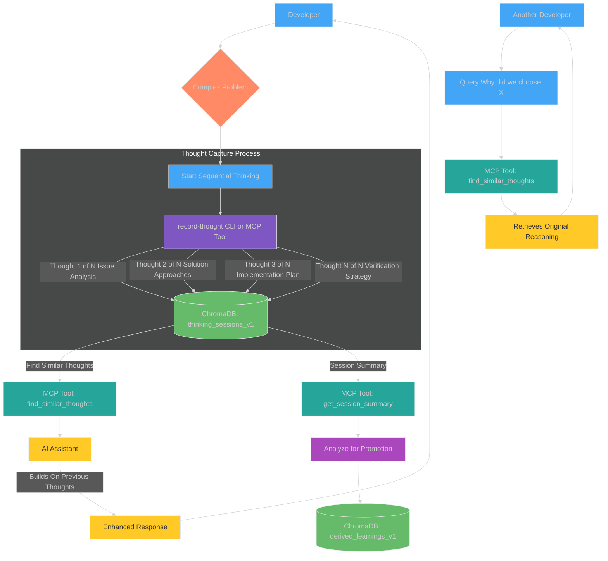

#### How Thought Collection Works

1. **Initiating Sequential Thinking**
   - When facing complex decisions or architectural planning, a developer starts a sequential thinking session.
   - Either through the `record-thought` CLI tool or MCP commands in an IDE, the developer records their thought process.
   - Each thought is numbered (e.g., "Thought 1 of N") and has a clear purpose (problem analysis, solution exploration, etc.).

2. **Structured Storage in ChromaDB**
   - Thoughts are stored in the `thinking_sessions_v1` collection with metadata including:
     - `session_id`: A unique identifier for the thinking session
     - `thought_number`: Sequential position in the thought process
     - `total_thoughts`: Total expected number of thoughts in the sequence
     - `branch_id`: Optional identifier if exploring alternative approaches
     - Timestamp and other contextual information

3. **Retrieval and Building on Previous Thoughts**
   - The `find_similar_thoughts` MCP tool can retrieve relevant thoughts from past sessions.
   - AI assistants use the `memory-integration-rule` to reference earlier thoughts and maintain continuity.
   - New thoughts can explicitly build on previous ones, creating a coherent chain of reasoning.

4. **Knowledge Transfer and Learning**
   - Complete thought sessions can be analyzed for promotion to the `derived_learnings_v1` collection.
   - Other developers can search for reasoning behind technical decisions, accessing the original thought process.
   - AI assistants can leverage past thinking patterns to provide more contextually appropriate suggestions.

#### Practical Application Example

Consider a developer trying to choose between two data storage approaches:

1. Developer writes "Thought 1 of 4: We need to decide between SQLite and PostgreSQL for our data layer. Our requirements are..."
2. Continues with "Thought 2 of 4: SQLite advantages include... PostgreSQL advantages include..."
3. Proceeds to "Thought 3 of 4: Decision matrix comparing factors with weighted scoring..."
4. Concludes with "Thought 4 of 4: Based on this analysis, we will use PostgreSQL because..."

Later, when another team member asks, "Why are we using PostgreSQL?" the system can retrieve this exact reasoning process, preserving institutional knowledge that would otherwise be lost.

### 2. Code and Chat Auto-Logging with Bidirectional Linking

The heart of the "Second Brain" is the automatic capture of code changes and related discussions, connected through bidirectional links that enable comprehensive context retrieval.

*Fig 4: Code and Chat Auto-Logging Flow - Capturing context and creating bidirectional links.*


📋 View mermaid source code

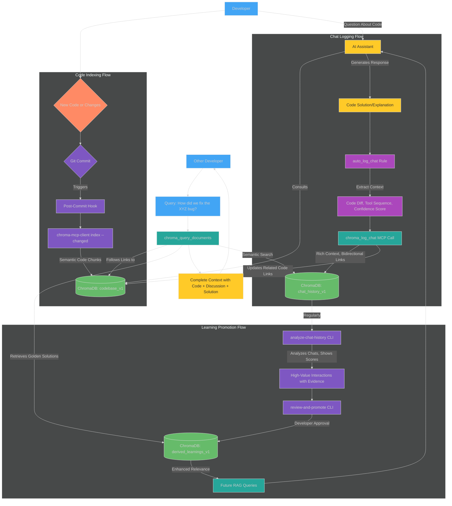

#### How Code and Chat Logging Works

1. **Automated Code Indexing**
   - When a developer commits code changes, the post-commit hook triggers `chroma-mcp-client index --changed`.
   - The code is semantically chunked (by function, class, or logical section) rather than by arbitrary line counts.
   - Each chunk is stored in `codebase_v1` with metadata including file path, commit hash, and timestamps.

2. **Enhanced Context Capture During AI Interaction**
   - When a developer interacts with an AI assistant, the assistant queries the codebase for context.
   - After providing a response (which may include code edits), the `auto_log_chat` rule activates.
   - This rule extracts rich context including:
     - Before/after code snippets when edits were made
     - Detailed diffs showing exactly what changed
     - The sequence of tools used (e.g., read_file→edit_file→run_terminal_cmd)
     - A confidence score reflecting the perceived value of the interaction
     - Categories of modification (refactor/bugfix/feature/documentation)

3. **Bidirectional Linking Creation**
   - The logging process automatically creates links between:
     - The chat entry in `chat_history_v1` and the relevant code chunks in `codebase_v1`
     - The code chunks and any chat entries that modified or discussed them
   - These bidirectional links allow navigation seamlessly between code and discussions, answering questions like:
     - "Who changed this code and why?"
     - "What other parts of the codebase were affected by this discussion?"
     - "What's the history of changes to this function?"

4. **Learning Promotion Pipeline**
   - The `analyze-chat-history` CLI tool regularly processes entries in `chat_history_v1`.
   - It prioritizes entries with high confidence scores or significant code impact.
   - These candidates are presented through the `review-and-promote` interface.
   - Upon developer approval, they're elevated to `derived_learnings_v1` with all relevant context preserved.

#### Practical Application Example 1

1. A developer asks the AI about optimizing a slow database query.
2. The AI retrieves the query from `codebase_v1`, suggests improvements, and helps implement them.
3. The `auto_log_chat` rule captures:
   - The original slow query and the optimized version (diff)
   - The sequence of tools used to inspect and modify the code
   - A high confidence score because the change significantly improved performance
   - Links to the affected code chunks
4. Later, `analyze-chat-history` flags this high-confidence interaction for review.
5. Using `review-and-promote`, the developer approves it as a derived learning.
6. When another developer encounters performance issues with queries, both the code and the reasoning behind the optimization pattern are automatically available.

### 3. Test Result Integration and Error-Driven Learning

The "Second Brain" captures test results, tracks transitions from failure to success, and uses this evidence to validate and prioritize learnings based on concrete improvements.

*Fig 5: Test-Driven Learning Flow - Capturing test transitions and using them as validation evidence.*


📋 View mermaid source code

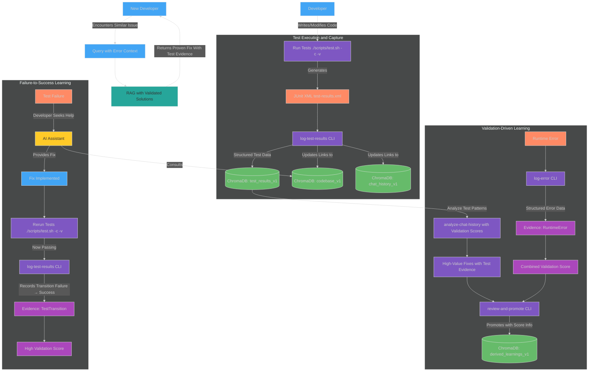

#### How Test-Driven Learning Works

1. **Automated Test Workflow**
   - The `setup-test-workflow` command creates Git hooks that automatically track test executions
   - The enhanced `test.sh` script can now run with the `--auto-capture-workflow` flag to automatically handle failure capture
   - The `check-test-transitions` command detects when failed tests start passing and creates validation evidence
   - For full details, see the [Automated Test Workflow Guide](usage/automated_test_workflow.md)

2. **Test Result Capture**
   - The enhanced `test.sh` script generates JUnit XML output during test execution.
   - The `log-test-results` CLI tool processes this XML and stores structured data in `test_results_v1`.
   - Each test result includes status (pass/fail/skip), duration, error messages for failures, and links to relevant code chunks and chat history entries.

3. **Failure-to-Success Tracking**
   - When a test fails, the developer might seek AI assistance to debug and fix it.
   - After implementing the fix, tests are re-run and hopefully pass.
   - The system captures this transition from failure to success as concrete evidence of a valuable solution.
   - This creates a `TestTransitionEvidence` record linking the initial failure, the fix discussion, and the eventual success.

4. **Error Logging and Correlation**
   - Runtime errors can be logged using the `log-error` CLI command.
   - These are structured as `RuntimeErrorEvidence` with context, affected code, and resolution status.
   - Both test transitions and error resolutions contribute to validation scores.

5. **Validation-Driven Learning Promotion**
   - The `analyze-chat-history` tool now incorporates validation evidence.
   - It ranks chat entries by validation score, prioritizing those with concrete evidence of improvement.
   - The `review-and-promote` interface displays validation evidence during review.
   - Solutions that resolved test failures or fixed errors receive higher priority for promotion.

6. **Evidence-Based RAG Enhancement**
   - The `derived_learnings_v1` collection now includes validation scores and evidence.
   - RAG queries can prioritize solutions with stronger validation evidence.
   - This ensures that returned solutions have proven track records of resolving similar issues.

#### Practical Application Example 2

1. A developer runs tests, and a specific test fails with a cryptic error message.
2. They ask the AI for help, and together they diagnose the issue as a race condition.
3. The AI suggests a synchronization approach, which the developer implements.
4. Running the tests again shows the test now passes consistently.
5. This transition is captured by `log-test-results` as evidence of a valuable fix.
6. Later, `analyze-chat-history` flags this interaction due to its high validation score.
7. The solution is promoted to `derived_learnings_v1` with its test evidence attached.
8. When another developer encounters similar synchronization issues, the system can provide a solution with proven effectiveness.

## The Integrated Learning Ecosystem

These three flows work together as complementary parts of a unified learning ecosystem:

*Fig 6: The Integrated Learning Ecosystem - Three complementary knowledge flows feeding a unified Second Brain.*


📋 View mermaid source code

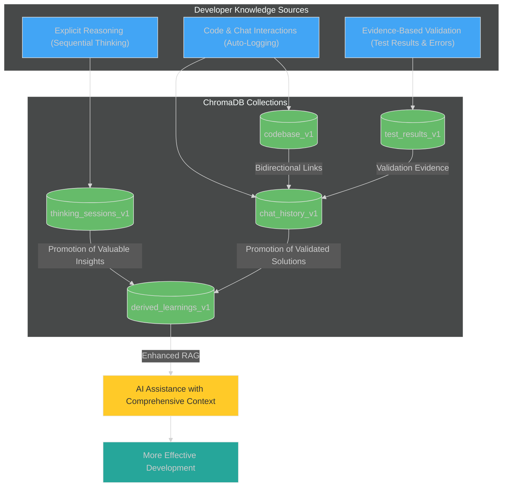

### Key Integration Points

1. **Comprehensive Knowledge Capture**
   - **Explicit Reasoning:** The "why" behind decisions via sequential thinking
   - **Implementation Details:** The "how" via code and chat logging
   - **Empirical Validation:** The "proof" via test results and error resolution

2. **Cross-Referenced Context**
   - Bidirectional links connect discussions, code changes, test results, and thought processes
   - A single query can retrieve multiple perspectives on the same issue

3. **Evidence-Based Prioritization**
   - Validation scores combine multiple forms of evidence
   - Test transitions provide concrete proof of solution effectiveness
   - High-confidence interactions with validation evidence receive priority for promotion

4. **Continuous Improvement Loop**
   - New knowledge is constantly captured and indexed
   - Valuable patterns are promoted to derived learnings
   - Future development benefits from accumulated knowledge
   - Test results provide objective measurement of improvement

This integrated approach creates a truly comprehensive "Second Brain" that captures not just what was done, but why it was done, how well it worked, and the evidence to support its effectiveness.

## Leveraging the Ecosystem in Your Project: A Phased Journey

1. **Phase 1 - Build the Foundation (Available Now):**
    - **Setup:** Configure your `.env`, install `chroma-mcp-server[full,client,dev]`, set up the `post-commit` hook (see [Automating Codebase Indexing with Git Hooks](./automation/git_hooks.md)), and configure the `auto_log_chat` rule in your IDE (see [Automated Chat History Logging Guide](./integration/automated_chat_logging.md)).
    - **Automated Test Workflow:** Configure the automated test-driven learning workflow with `chroma-mcp-client setup-test-workflow` to automatically track test failures and successes (see [Automated Test Workflow Guide](./usage/automated_test_workflow.md)).
    - **Daily Workflow:** Commit your changes (auto-indexing). Interact with your AI (auto-logging with rich context). Use `record-thought` for key decisions. Query `codebase_v1` and `chat_history_v1` via MCP tools. Start curating `derived_learnings_v1` using the `review-and-promote` interface. Run tests with `--auto-capture-workflow` to automatically track test transitions.
    - **ROI Measurement (Planned):** When implemented, enable test result tracking to establish baseline metrics for code quality, then use the reports and dashboards to monitor improvements as you leverage the knowledge base.

2. **Phase 2 - Specialize Your AI (Coming Soon):**
    - **Action:** When you identify repetitive tasks or specific domains where tailored AI could help, use `chroma-mcp-client export-rl-dataset` to create training data from your best interactions/learnings.
    - **Train & Use:** Manually run `scripts/train_lora.sh` and experiment with using the resulting LoRA adapter in your IDE.

3. **Phase 3 - Automate the Learning Loop (In Development):**
    - **Setup:** Implement and schedule the automation scripts (`nightly_analysis.sh`, etc.). Consider a shared ChromaDB for team-wide benefits.
    - **Benefit:** Observe as your AI assistant becomes increasingly attuned to your project over time with minimal ongoing manual effort.

## Trade-offs and Considerations

- **Initial Setup:** Requires setting up the `.env` file, installing dependencies (`hatch`, `chroma-mcp-server[full,client,dev]`), and configuring the Git hook script in each developer's local clone (though can be project-level if devs agree).
- **Dependency:** The hook relies on `hatch` being installed and accessible in the PATH where `git commit` is run.
- **Commit Overhead:** The post-commit hook adds a small delay to each commit (usually minimal for incremental changes).
- **Discipline:** The value of Thinking Utilities and promoting derived learnings depends on consistent use. Phase 3 automation lessens this for LoRA improvements.
- **Storage:** The ChromaDB database will grow. Regular review and potential archiving strategies for very old `chat_history_v1` might be needed.
- **Phase 3 Complexity:** Setting up and maintaining the automated RL pipeline requires more effort and understanding of the components involved, including potential compute resources for regular LoRA retraining.

## Conclusion: Your Project's Living, Learning Memory

The Chroma MCP Server ecosystem, especially when evolving through the phases outlined in [local_rag_pipeline_plan_v4.md](refactoring/local_rag_pipeline_plan_v4.md), is more than just a database or a set of tools. It's a fundamental shift from scattered, static project artifacts to a **dynamic, integrated, and continuously learning "second brain."**

By **automating the critical capture of code evolution and developer-AI dialogues with rich context from day one (Phase 1)**, it immediately elevates your ability to find information and provides AI with relevant context. As you optionally progress to **specializing your AI with LoRA (Phase 2)** and then **fully automating the learning loop (Phase 3)**, this "second brain" transforms into an intelligent partner that adapts and grows alongside your project and team. This isn't just about better RAG; it's about creating a smarter, more efficient, and ultimately more rewarding development experience.

---

*For setup and API usage, see the main README and API reference in this docs directory.*
