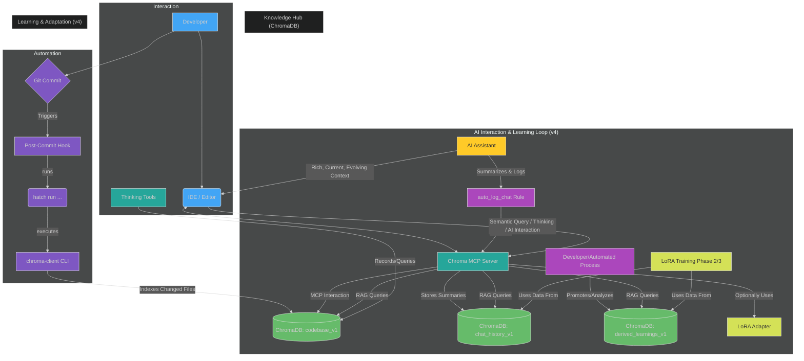

# Why Every Developer Needs Chroma MCP Server: Getting started with your "Second Brain"

## Introduction: The Scattered Knowledge Problem

Modern software projects generate a wealth of knowledge: design decisions, bug fixes, best practices, architectural notes, and lessons learned. Yet, traditionally, this crucial information gets scattered across markdown files, code comments, commit messages, chat logs, and issue trackers. Retrieving the right piece of context when needed often involves tedious manual searching (grep, Ctrl+F, digging through history), hindering productivity and increasing the risk of repeating past mistakes.

**Chroma MCP Server and its ecosystem** offer a transformative solution: an integrated, persistent, semantically searchable, and *evolving* knowledge base built directly into your development workflow. This document explains the unique value proposition and how this ecosystem acts as a powerful "second brain" for developers and AI assistants alike, especially when following the evolutionary path laid out in our `local_rag_pipeline_plan_v4.md`.

**Note on Ongoing Development:** The "Second Brain" concept described here is being implemented through a phased approach defined in `docs/refactoring/local_rag_pipeline_plan_v4.md`. While the foundational capabilities outlined in Phase 1 (automated code indexing, chat logging, working memory) are largely functional, the more advanced features involving automated analysis, LoRA fine-tuning (Phase 2), and the full automated reinforcement learning pipeline (Phase 3) are currently under active development.

## Development Cycles Compared

### Traditional Workflow: Scattered Knowledge & Manual Search

*Fig 1: Traditional workflow - Knowledge is fragmented, context for AI is often stale, and retrieval is a manual, time-consuming chore.*

### Improved Workflow: Integrated, Evolving Knowledge with Chroma MCP Ecosystem (v4 Plan)

*Fig 2: The Chroma MCP ecosystem - Automated indexing, chat logging, and a phased learning loop create a unified, always-current, and evolving knowledge hub.*

## The Chroma MCP Ecosystem: Components

This enhanced workflow is powered by:

1. **Chroma MCP Server:** The central hub for *interactive* tasks, communicating via the Model Context Protocol (MCP). Used by IDEs and AI assistants for querying, feedback, and thinking tools. It serves as the gateway to the ChromaDB knowledge hub.
2. **`chroma-mcp-client` CLI:** A command-line interface for *automated* tasks, primarily codebase indexing into `codebase_v1`. It interacts directly with ChromaDB based on `.env` settings.
3. **Git Post-Commit Hook:** An **automated script** that **automatically triggers** the `chroma-mcp-client` CLI to index changed files into `codebase_v1` immediately after each commit.
4. **Thinking Utilities:** Python tools and MCP commands for capturing and retrieving structured thought processes (e.g., into `thinking_sessions_v1`) within ChromaDB, accessible via the MCP Server.
5. **Automated Chat Logging Rule (`auto_log_chat`):** An **IDE rule** that **automatically instructs** the AI assistant to summarize and log chat interactions to the `chat_history_v1` collection in ChromaDB via MCP calls after each response.
6. **ChromaDB Collections:** The persistent store for:
    * `codebase_v1`: Up-to-the-minute indexed code.
    * `chat_history_v1`: A rich log of AI-developer dialogues.
    * `derived_learnings_v1`: Curated, high-quality insights and validated solutions promoted from chat history or other sources.
    * `thinking_sessions_v1`: Developer's structured thoughts and reasoning.
7. **(Phases 2 & 3) Learning Pipeline Components:** Scripts and processes for exporting reward datasets (`rl_dataset_*.jsonl`), training LoRA adapters (`lora_codelearn_*.safetensors`), and automating this cycle.

## Unique Selling Proposition (USP): The Integrated, Evolving "Second Brain"

The traditional development workflow forces developers to be digital archaeologists, constantly digging through scattered, often outdated, fragments of information. AI assistants in such environments operate with one hand tied behind their back, lacking deep, current project context. The Chroma MCP Server ecosystem, as envisioned in the `local_rag_pipeline_plan_v4.md`, offers a radical improvement: **a unified, automated, and evolving "Second Brain" that grows with your project and actively enhances both developer and AI performance.**

**How is it Different and Why is it Better?**

1. **Automated Contextual Foundation (Solves Fragmentation & Staleness - Phase 1 onwards):**
    * **Traditional Pain:** Manually searching through Git logs, code comments, separate doc files, and endless chat histories. AI suggestions are generic or based on incomplete snippets you feed it.
    * **Chroma MCP Solution & WHY it's better:**
        * **Code (`codebase_v1`):** The Git hook **automatically indexes every change on commit.** Your codebase context is *always fresh* without a single manual indexing command.

          **HOW:** `chroma-client index --changed` runs silently in the background.
        * **Dialogues (`chat_history_v1`):** The `auto_log_chat` rule **automatically captures the essence of every AI interaction.** No more "Where did we discuss that bug?" – it's logged and searchable.

          **HOW:** AI summarizes prompt/response and calls an MCP tool.
        * This automation alone is a massive productivity boost over manual methods.

2. **Unified & Semantically Searchable Knowledge Hub (Solves Scattered Information - Phase 1 onwards):**
    * **Traditional Pain:** Information silos. Code is in the repo, design docs elsewhere, quick fixes in chat, error solutions in commit messages. Finding related pieces is a nightmare.
    * **Chroma MCP Solution & WHY it's better:** `codebase_v1`, `chat_history_v1`, `derived_learnings_v1`, and `thinking_sessions_v1` all reside in ChromaDB, accessible via the same semantic search capabilities. You can ask "Show me code related to X AND discussions where we fixed Y using X."

      **HOW:** MCP tools query across these collections, providing multifaceted context.

3. **Explicit Knowledge Curation & Refinement (Empowers Precision - Phase 1 onwards):**
    * **Traditional Pain:** Tacit knowledge is lost. Useful snippets from chats or temporary solutions are forgotten. No easy way to flag "this is a golden solution."
    * **Chroma MCP Solution & WHY it's better:** The `derived_learnings_v1` collection allows developers to **explicitly promote and structure validated solutions and best practices.** This curated knowledge becomes a high-signal resource for both humans and AI, significantly boosting RAG quality.

      **HOW:** `promote-learning` CLI (or manual process) creates structured entries in `derived_learnings_v1`.

4. **Evolutionary Learning & Adaptation (Transforms AI from Tool to Partner - Phases 2 & 3):**
    * **Traditional Pain:** AI assistants are static tools. They don't learn from your project's specific nuances, coding style, or past corrections beyond the immediate conversation.
    * **Chroma MCP Solution & WHY it's better:**
        * **Phase 2 (Optional LoRA):** Developers can **manually fine-tune LoRA adapters** using high-quality data from `chat_history_v1` / `derived_learnings_v1`. This allows AI to be *specialized* for specific, recurring project tasks.

          **HOW:** Export reward data, train LoRA, use on-demand in IDE.

        * **Phase 3 (Automated RL):** The system **automatically analyzes interactions, generates training data, and retrains LoRA models.** The "Second Brain" doesn't just store information; it *learns and adapts*, continuously improving its understanding and the relevance of its suggestions.

          **HOW:** Scheduled scripts automate the analysis, training, and deployment cycle.

        * **This makes the AI a continuously improving partner that understands your project's evolving context deeply.**

5. **Seamless Workflow Integration (Reduces Friction - All Phases):**
    * **Traditional Pain:** Constantly switching contexts, copying-pasting, manually updating docs, or trying to remember to log important decisions.
    * **Chroma MCP Solution & WHY it's better:** Knowledge capture and retrieval are embedded in existing developer tools (Git via hooks, IDE via MCP tools and rules). The system works *with* you, not against you.

## Key Benefits: A Phased Transformation of Your Daily Work

The Chroma MCP ecosystem, following the v4 plan, offers compounding benefits as you progress through its phases, directly addressing the inefficiencies of traditional workflows.

### Phase 1: From Scattered Notes to an Organized, Queryable Knowledge Base

Even at its foundational phase, the system provides a revolutionary upgrade to how you manage and access project knowledge.

* **Benefit: Instant, Reliable Context Retrieval (Code, Chats, Validated Learnings)**
  * **WHY (vs. Traditional):** Slashes time wasted on `grep`-ing through stale code, hunting for old chat messages, or trying to recall undocumented decisions. Reduces reliance on fallible human memory or out-of-sync documentation. **Your search queries now tap into a live, multifaceted project memory.**
  * **HOW (v4 Feature):**
    * **Always-Current Code:** Automated indexing of `codebase_v1` via Git hook.
    * **Complete Dialogue History:** Automated logging of AI interactions to `chat_history_v1` via `auto_log_chat` rule.
    * **Curated Wisdom:** Manually promoted, high-quality solutions in `derived_learnings_v1`.
    * **Unified Search:** MCP tools like `chroma_query_documents` semantically search across these relevant collections.

* **Benefit: Effortless Knowledge Capture & Preservation – Nothing Important Gets Lost**
  * **WHY (vs. Traditional):** Critical insights from a quick debug session, a valuable AI suggestion, or a design rationale are no longer lost in ephemeral chats, uncommitted local notes, or forgotten entirely. **The system automatically remembers for you.**
  * **HOW (v4 Feature):**
    * **Code Evolution:** Git hook captures every version.
    * **AI Dialogues:** `auto_log_chat` ensures every AI interaction summary is stored.
    * **Developer Reasoning:** `record-thought` allows explicit capture of decision-making processes.
    * **Golden Nuggets:** `promote-learning` workflow elevates key insights into `derived_learnings_v1`.

* **Benefit: More Accurate and Relevant AI Assistance (Baseline)**
  * **WHY (vs. Traditional):** AI suggestions are grounded in *your* project's actual, up-to-date code, documented learnings, and past discussions, not generic examples or its pre-training data. **This drastically reduces irrelevant suggestions and hallucinations.**
  * **HOW (v4 Feature):** AI uses RAG over the fresh, rich context from `codebase_v1`, `chat_history_v1`, and `derived_learnings_v1`.

### Phase 2: Tailoring AI to Your Specific Needs (Optional LoRA Fine-Tuning)

This phase empowers you to actively shape your AI assistant into a specialist for your project.

* **Benefit: Hyper-Productivity for Repetitive or Domain-Specific Tasks**
  * **WHY (vs. Traditional):** Instead of manually writing similar boilerplate code, complex domain-specific logic, or spending significant time crafting detailed prompts for a generic AI, you get highly tailored, near-instant suggestions for tasks the LoRA has mastered. **It's like having an AI apprentice you've personally trained.**
  * **HOW (v4 Feature):** Developer manually trains a LoRA adapter using the `rl_dataset.jsonl` (exported from their best interactions in `chat_history_v1` or `derived_learnings_v1`). This specialized adapter can then be used on-demand in the IDE.

* **Benefit: Taking Active Control in Shaping AI Behavior for Your Context**
  * **WHY (vs. Traditional):** You transition from being a passive consumer of a general-purpose AI to an active trainer, guiding the AI to excel in areas most critical to *your* project. **This grants you a new level of leverage over AI capabilities.**
  * **HOW (v4 Feature):** The process of curating the reward dataset and fine-tuning the LoRA is a direct mechanism to impart specific knowledge, coding styles, and problem-solving patterns.

### Phase 3: A "Second Brain" That Learns and Evolves With You (Automated RL)

This is where the "Second Brain" truly comes alive, becoming a continuously improving, proactive partner.

* **Benefit: An AI Partner That Continuously Adapts and Improves Alongside Your Project**
  * **WHY (vs. Traditional):** The AI's understanding and suggestions don't become stale or misaligned as your project evolves. It automatically keeps up with new patterns, refactorings, and solutions adopted by the team, minimizing the need for repeated explanations or correcting outdated AI suggestions. **Your AI gets smarter about *your project* over time, automatically.**
  * **HOW (v4 Feature):** Scheduled automation scripts (`nightly_analysis.sh`, `retrain_lora_incrementally.sh`, `deploy_adapter.sh`) create a closed loop: analyze implemented AI suggestions from `chat_history_v1`, generate fresh reward data, retrain the LoRA model, and deploy the improved adapter.

* **Benefit: Reduced Cognitive Load & Accelerated Team Onboarding (Especially with a Shared ChromaDB)**
  * **WHY (vs. Traditional):** The system itself becomes a dynamic repository of the latest team-wide best practices and project-specific knowledge. New team members can get up to speed faster by interacting with an AI that's already deeply versed in the project's current state and conventions. Experienced developers spend less time re-explaining established patterns.
  * **HOW (v4 Feature):** The AI, consistently powered by the latest LoRA (potentially trained on team-wide data if using a shared ChromaDB), provides suggestions and explanations that are aligned with current team practices. The `derived_learnings_v1` also serves as an explicit knowledge base.

## Leveraging the Ecosystem in Your Project: A Phased Journey

1. **Phase 1 - Build the Foundation:**
    * **Setup:** Configure your `.env`, install `chroma-mcp-server[full,client,dev]`, set up the `post-commit` hook (see [Automating Codebase Indexing with Git Hooks](./automation/git_hooks.md)), and configure the `auto_log_chat` rule in your IDE (see [Automated Chat History Logging Guide](./integration/automated_chat_logging.md)).
    * **Daily Workflow:** Commit your changes (auto-indexing). Interact with your AI (auto-logging). Use `record-thought` for key decisions. Query `codebase_v1` and `chat_history_v1` via MCP tools. Start curating `derived_learnings_v1`.

2. **Phase 2 - Specialize Your AI (Optional):**
    * **Action:** When you identify repetitive tasks or specific domains where tailored AI could help, use `chroma-client export-rl-dataset` to create training data from your best interactions/learnings.
    * **Train & Use:** Manually run `scripts/train_lora.sh` and experiment with using the resulting LoRA adapter in your IDE.

3. **Phase 3 - Automate the Learning Loop:**
    * **Setup:** Implement and schedule the automation scripts (`nightly_analysis.sh`, etc.). Consider a shared ChromaDB for team-wide benefits.
    * **Benefit:** Observe as your AI assistant becomes increasingly attuned to your project over time with minimal ongoing manual effort.

## Trade-offs and Considerations

* **Initial Setup:** Requires setting up the `.env` file, installing dependencies (`hatch`, `chroma-mcp-server[full,client,dev]`), and configuring the Git hook script in each developer's local clone (though can be project-level if devs agree).
* **Dependency:** The hook relies on `hatch` being installed and accessible in the PATH where `git commit` is run.
* **Commit Overhead:** The post-commit hook adds a small delay to each commit (usually minimal for incremental changes).
* **Discipline:** The value of Thinking Utilities and promoting derived learnings depends on consistent use. Phase 3 automation lessens this for LoRA improvements.
* **Storage:** The ChromaDB database will grow. Regular review and potential archiving strategies for very old `chat_history_v1` might be needed.
* **Phase 3 Complexity:** Setting up and maintaining the automated RL pipeline requires more effort and understanding of the components involved, including potential compute resources for regular LoRA retraining.

## Conclusion: Your Project's Living, Learning Memory

The Chroma MCP Server ecosystem, especially when evolving through the phases outlined in `local_rag_pipeline_plan_v4.md`, is more than just a database or a set of tools. It's a fundamental shift from scattered, static project artifacts to a **dynamic, integrated, and continuously learning "second brain."**

By **automating the critical capture of code evolution and developer-AI dialogues from day one (Phase 1)**, it immediately elevates your ability to find information and provides AI with relevant context. As you optionally progress to **specializing your AI with LoRA (Phase 2)** and then **fully automating the learning loop (Phase 3)**, this "second brain" transforms into an intelligent partner that adapts and grows alongside your project and team. This isn't just about better RAG; it's about creating a smarter, more efficient, and ultimately more rewarding development experience.

---

*For setup and API usage, see the main README and API reference in this docs directory.*
