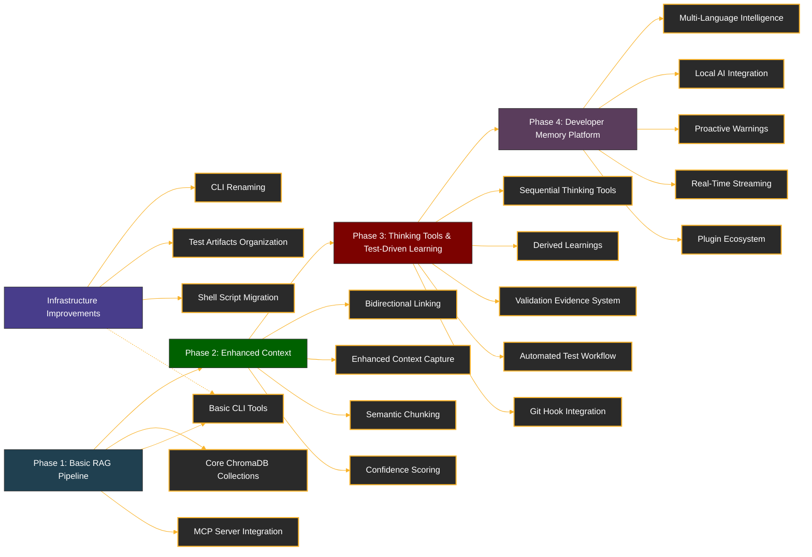

# Refactoring Documentation

This directory contains documentation related to various refactoring efforts and architectural plans for the Chroma MCP Server project. The documents are organized chronologically by implementation sequence and grouped by subject area.

## Document Index

| Document | Purpose | Timeline | Implementation Status/Remarks |
|----------|---------|----------|-------------------------------|
| [local_rag_pipeline_plan_v1.md](./local_rag_pipeline_plan_v1.md) | Initial plan for the Local RAG (Retrieval Augmented Generation) pipeline architecture | Phase 1 | Initial design document, superseded by v2 |
| [local_rag_pipeline_plan_v2.md](./local_rag_pipeline_plan_v2.md) | Revised plan for the Local RAG pipeline with improved collection structure | Phase 1 | Refinement of v1, incorporating feedback and clarifying collection roles |
| [local_rag_pipeline_plan_v3.md](./local_rag_pipeline_plan_v3.md) | Enhanced Local RAG pipeline with added bidirectional linking and context management | Phase 2 | Extended v2 with enhanced context capture features |
| [local_rag_pipeline_plan_v4.md](./local_rag_pipeline_plan_v4.md) | Current implementation plan with comprehensive context capture, thinking tools integration, and automated test-driven learning | Phase 2-3 | Active plan with significant progress - context capture, bidirectional linking, validation evidence system, and automated test workflow now fully implemented |
| [persistent-developer-memory-service-v1.md](./persistent-developer-memory-service-v1.md) | Evolution to comprehensive "Developer Memory Platform" with cross-language support, AI-powered reasoning, real-time collaboration, and enhanced technical capabilities | Phase 4 | Future roadmap building on v4 foundation - focuses on multi-language intelligence, local AI integration, proactive warnings, and community plugin ecosystem |
| [learning_validation_workflow.md](./learning_validation_workflow.md) | Error-driven learning validation approach for promoting only validated learnings | Phase 3 | Implementation plan for evidence-based learning validation |
| [refactor_plan_mcp_sdk_compliance_v1.md](./refactor_plan_mcp_sdk_compliance_v1.md) | Initial plan for making Chroma MCP Server compliant with MCP SDK standards | Independent | First version of SDK compliance plan |
| [refactor_plan_mcp_sdk_compliance_v2.md](./refactor_plan_mcp_sdk_compliance_v2.md) | Detailed plan for MCP SDK compliance with expanded implementation details | Independent | Current SDK compliance plan with detailed implementation steps |
| [hatch_smithery_integration.md](./hatch_smithery_integration.md) | Documentation for integrating Hatch and Smithery build tools into the project | Infrastructure | Implemented for development workflow improvements |
| [mcp-reference.md](./mcp-reference.md) | Reference documentation for MCP (Model Control Protocol) implementation | Reference | Provides specifications and guidelines for MCP development |
| [client_rename_plan.md](./client_rename_plan.md) | Plan for renaming the CLI executable from `chroma-client` to `chroma-mcp-client` | Infrastructure | Phase 1 (entry points, deprecation warnings) implemented |
| [test_artifacts_organization_plan.md](./test_artifacts_organization_plan.md) | Plan for organizing test artifacts in a dedicated `logs/tests/` directory structure | Infrastructure | Phase 1 (directory structure, cleanup logic) implemented |
| [shell_script_migration_plan.md](./shell_script_migration_plan.md) | Plan for migrating all shell scripts to Python modules to improve maintainability, testability, and platform compatibility | Infrastructure | Phase 1 complete - all scripts and tests migrated to Python modules; remaining work: documentation |
| [roi_measurement_plan.md](./roi_measurement_plan.md) | Plan for measuring the ROI of the RAG implementation | Phase 4 | Initial plan for ROI measurement framework development |

## Implementation Phases Explained

### Evolution Roadmap

### Phase 1: Basic Local RAG Pipeline

The initial implementation focused on creating a functioning RAG pipeline with basic collection structure and core functionality. This established the foundation for storing and retrieving chat history and code snippets.

### Phase 2: Enhanced Context Capture

Building on the basic pipeline, this phase focused on enriching the context capture with bidirectional linking between code and discussions, tool sequence tracking, confidence scoring, and semantic code chunking. This enhancement significantly improved the quality of retrieved context.

### Phase 3: Thinking Tools and Test-Driven Learning Integration

The current phase integrates the sequential thinking utilities with the enhanced context system, while adding comprehensive test-driven learning capabilities. Key achievements include:

- A complete framework for reasoning about code changes with rich contextual awareness
- Automated test workflow that captures test failures and success transitions
- Validation evidence system that links test results to code changes and discussions
- Git hook integration for continuous monitoring of test health
- Promotion mechanism for high-quality fixes to derived learnings

### Phase 4: Developer Memory Platform

This future roadmap phase transforms the system into a comprehensive "Developer Memory Platform" with advanced technical capabilities:

- **Multi-Language Intelligence**: Universal pattern recognition and cross-language learning transfer across Python, JavaScript, Java, Go, Rust, and community-contributed languages
- **Local AI Integration**: Advanced reasoning capabilities with local AI models (Ollama, etc.) and optional cloud model integration for sophisticated analysis and insights
- **Proactive Warning System**: Real-time code analysis against historical patterns with intelligent risk assessment and recommendation engine
- **Real-Time Streaming**: WebSocket-based memory streaming for live team synchronization and collaborative learning propagation
- **Community Plugin Ecosystem**: Comprehensive plugin architecture enabling community-driven extensions, IDE integrations, and tool-specific adapters

This phase emphasizes maintaining the open-source, self-hosted foundation while significantly expanding technical capabilities and community engagement.

## Other Refactoring Efforts

In parallel with the RAG pipeline development, other refactoring efforts have addressed:

1. **SDK Compliance**: Ensuring the Chroma MCP Server adheres to MCP SDK standards for interoperability.
2. **Build System Improvements**: Integration of Hatch and Smithery for improved development workflow.
3. **Collection Schema Evolution**: Progressive refinement of the ChromaDB collection schema to support richer metadata and more effective retrieval.
4. **Test Result Integration**: Implementation of structured test result tracking and automated test-driven learning workflows. This includes JUnit XML parsing, test transition detection (failure→success), validation evidence creation, and bidirectional linking between test results, code changes, and chat history.
5. **CLI Renaming**: Renaming the `chroma-client` executable to `chroma-mcp-client` for better naming consistency with `chroma-mcp-server` and to avoid potential conflicts with official Chroma tools. The implementation includes backward compatibility through version 0.2.x with deprecation warnings, and a planned removal of the old entry point in version 0.3.0.
6. **Test Artifacts Organization**: Organizing test artifacts in a dedicated `logs/tests/` directory structure to improve clarity and maintainability.
7. **Shell Script Migration**: Migration of all shell scripts to Python modules to improve maintainability, testability, and platform compatibility; original shell scripts in `scripts/` are deprecated and will be removed in version 0.3.0.
8. **ROI Measurement**: Development of a framework for quantifying the value and effectiveness of the RAG implementation.

For questions about specific implementations, refer to the individual documents or review the implementation code in the corresponding modules.
