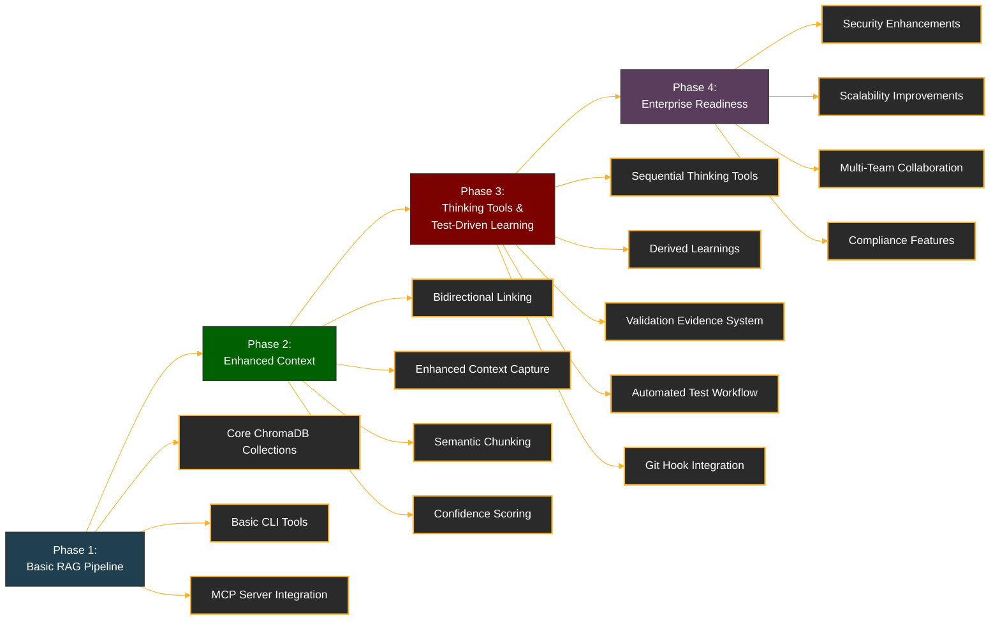

# Refactoring Documentation

This directory contains documentation related to various refactoring efforts and architectural plans for the Chroma MCP Server project. The documents are organized chronologically by implementation sequence and grouped by subject area.

## Document Index

| Document | Purpose | Timeline | Implementation Status/Remarks |
|----------|---------|----------|-------------------------------|
| [local_rag_pipeline_plan_v1.md](./local_rag_pipeline_plan_v1.md) | Initial plan for the Local RAG (Retrieval Augmented Generation) pipeline architecture | Phase 1 | Initial design document, superseded by v2 |
| [local_rag_pipeline_plan_v2.md](./local_rag_pipeline_plan_v2.md) | Revised plan for the Local RAG pipeline with improved collection structure | Phase 1 | Refinement of v1, incorporating feedback and clarifying collection roles |
| [local_rag_pipeline_plan_v3.md](./local_rag_pipeline_plan_v3.md) | Enhanced Local RAG pipeline with added bidirectional linking and context management | Phase 2 | Extended v2 with enhanced context capture features |
| [local_rag_pipeline_plan_v4.md](./local_rag_pipeline_plan_v4.md) | Current implementation plan with comprehensive context capture, thinking tools integration, and automated test-driven learning | Phase 2-3 | Active plan with significant progress - context capture, bidirectional linking, validation evidence system, and automated test workflow now fully implemented |
| [learning_validation_workflow.md](./learning_validation_workflow.md) | Error-driven learning validation approach for promoting only validated learnings | Phase 3 | Implementation plan for evidence-based learning validation |
| [enterprise-readiness-upgrade.md](./enterprise-readiness-upgrade.md) | Assessment and upgrade plan for enterprise deployment readiness | Phase 4 | Strategic roadmap for evolving the system to meet enterprise requirements in security, scalability, and compliance |
| [refactor_plan_mcp_sdk_compliance_v1.md](./refactor_plan_mcp_sdk_compliance_v1.md) | Initial plan for making Chroma MCP Server compliant with MCP SDK standards | Independent | First version of SDK compliance plan |
| [refactor_plan_mcp_sdk_compliance_v2.md](./refactor_plan_mcp_sdk_compliance_v2.md) | Detailed plan for MCP SDK compliance with expanded implementation details | Independent | Current SDK compliance plan with detailed implementation steps |
| [hatch_smithery_integration.md](./hatch_smithery_integration.md) | Documentation for integrating Hatch and Smithery build tools into the project | Infrastructure | Implemented for development workflow improvements |
| [mcp-reference.md](./mcp-reference.md) | Reference documentation for MCP (Model Control Protocol) implementation | Reference | Provides specifications and guidelines for MCP development |

## Implementation Phases Explained

### Evolution Roadmap

### Phase 1: Basic Local RAG Pipeline

The initial implementation focused on creating a functioning RAG pipeline with basic collection structure and core functionality. This established the foundation for storing and retrieving chat history and code snippets.

### Phase 2: Enhanced Context Capture

Building on the basic pipeline, this phase focused on enriching the context capture with bidirectional linking between code and discussions, tool sequence tracking, confidence scoring, and semantic code chunking. This enhancement significantly improved the quality of retrieved context.

### Phase 3: Thinking Tools and Test-Driven Learning Integration

The current phase integrates the sequential thinking utilities with the enhanced context system, while adding comprehensive test-driven learning capabilities. Key achievements include:

- A complete framework for reasoning about code changes with rich contextual awareness
- Automated test workflow that captures test failures and success transitions
- Validation evidence system that links test results to code changes and discussions
- Git hook integration for continuous monitoring of test health
- Promotion mechanism for high-quality fixes to derived learnings

### Phase 4: Enterprise Readiness Evolution

This planned phase focuses on evolving the system to meet enterprise-grade requirements across security, scalability, high availability, multi-team collaboration, and compliance. It provides a strategic roadmap for transforming the developer-focused implementation into a robust platform suitable for large organizational deployments.

## Other Refactoring Efforts

In parallel with the RAG pipeline development, other refactoring efforts have addressed:

1. **SDK Compliance**: Ensuring the Chroma MCP Server adheres to MCP SDK standards for interoperability.
2. **Build System Improvements**: Integration of Hatch and Smithery for improved development workflow.
3. **Collection Schema Evolution**: Progressive refinement of the ChromaDB collection schema to support richer metadata and more effective retrieval.
4. **Test Result Integration**: Implementation of structured test result tracking and automated test-driven learning workflows. This includes JUnit XML parsing, test transition detection (failure→success), validation evidence creation, and bidirectional linking between test results, code changes, and chat history.
5. **ROI Measurement**: Development of a framework for quantifying the value and effectiveness of the RAG implementation.

For questions about specific implementations, refer to the individual documents or review the implementation code in the corresponding modules.
