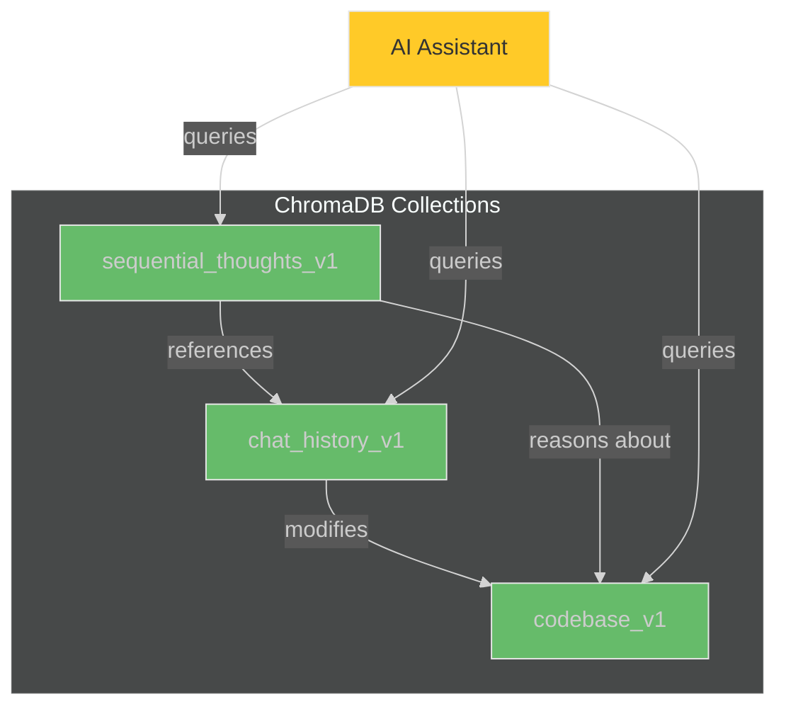
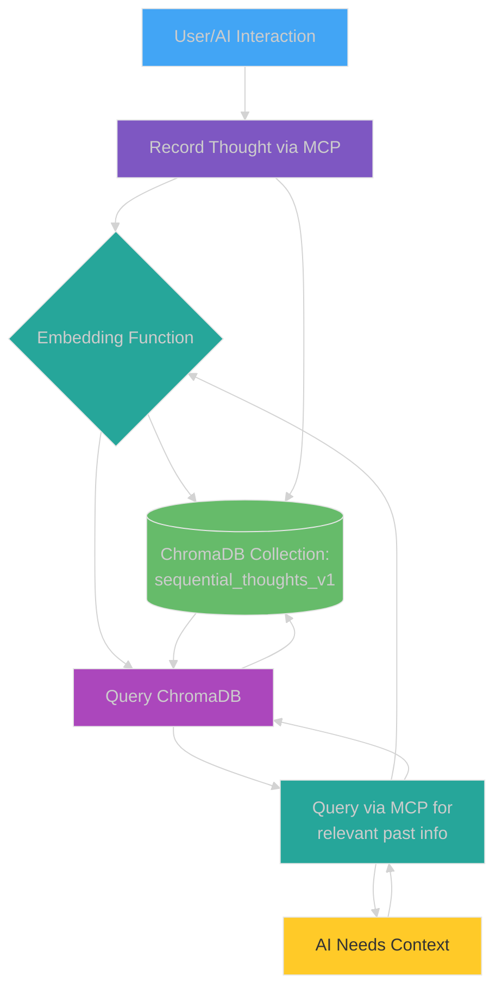

# Embeddings and Thinking Tools

This document describes the specialized tools available in `chroma-mcp-server` for managing embeddings and implementing sequential thinking patterns using ChromaDB as the underlying vector store.

## Embedding Function Management

The server utilizes embedding functions provided by ChromaDB (or compatible custom functions) to convert text into vector embeddings. The choice of embedding function impacts performance, cost (for API-based functions), and the quality of semantic search results.

**Key Concepts:**

* **Default Function:** The server starts with a default embedding function (e.g., `default` or `fast` using ONNX models, or another specified via `--embedding-function` at startup). See [Getting Started](./getting_started.md#choosing-an-embedding-function) for available options.
* **Runtime Selection:** While not directly supported by a dedicated tool in this reference, the underlying ChromaDB client can be configured with different embedding functions at startup (e.g., `openai`, `cohere`, `google`, `bedrock`, `ollama`). The server primarily uses the function it was initialized with.

**Related Tools:**

* `test_chroma_get_embedding_function`: Retrieves the name of the currently configured embedding function for the server.

## Sequential Thinking Tools

These tools leverage ChromaDB to store and retrieve sequences of thoughts, enabling structured reasoning and context management across multiple interactions. This is particularly useful for complex problem-solving or maintaining state in multi-turn conversations.

**Core Idea:**

The central concept is the **Sequential Thought**. This represents a single, discrete step or piece of information captured during a development session. Examples include:

* A specific user instruction (`Implement function X`)
* An AI's proposed plan (`1. Read file Y. 2. Modify class Z.`)
* A code snippet generated by the AI
* An error message encountered during testing
* A summary of a successful refactoring
* A key decision made (`Decided to use library A instead of B`)

These thoughts are stored chronologically within a **Thinking Session**, identified by a unique `session_id`.

## How Embeddings Power the Working Memory

Each recorded thought is automatically embedded into a vector representation by the configured embedding function (e.g., `default`, `accurate`, `openai`). These embeddings capture the semantic meaning of the thought's content.

* **Storage:** Thoughts and their embeddings are stored in a dedicated ChromaDB collection (`sequential_thoughts_v1`).
* **Retrieval:** When an AI assistant needs context from the past, it doesn't rely on simple keyword matching. Instead, it uses the `find_similar_thoughts` tool. This tool takes a query (e.g., "What was the plan for refactoring the database module?") and performs a **semantic search** against the stored thought embeddings.
* **Semantic Search:** ChromaDB finds thoughts whose embeddings are *semantically closest* to the query's embedding, even if the exact wording differs. This allows retrieving relevant past thoughts, plans, or code snippets based on their meaning, not just keywords.

## Integration with Enhanced Context Capture and Bidirectional Linking

The Thinking Utilities complement the enhanced context capture system and bidirectional linking:

* **Connection to Chat History:** Thinking sessions can reference discussions recorded in `chat_history_v1`, creating connections between explicit reasoning steps and AI-developer interactions.
* **Connection to Code Changes:** Thoughts can link to specific code chunks in `codebase_v1`, allowing AI to connect conceptual reasoning with concrete implementations.
* **Context-Rich Reasoning:** Recorded thoughts can utilize the enhanced context metadata (code diffs, tool sequences, confidence scores) from chat history entries to inform their reasoning.
* **Multi-Collection Queries:** When searching for context, AI can leverage both working memory (`sequential_thoughts_v1`) and the rich contextual information stored in `chat_history_v1` and `codebase_v1`.

This integration enables a more comprehensive understanding of the development process, where explicit reasoning steps can be linked to actual code changes and conversations:



## Embedding Models

The Chroma MCP Server relies on embedding models to represent text data (documents, thoughts) as numerical vectors. These vectors capture the semantic meaning of the text, enabling similarity searches.

### Selecting an Embedding Model

You can choose the embedding model the server uses via:

1. **Command-Line Argument:** Use the `--embedding-function` argument when starting the server. For example:

    ```bash
    uvx chroma-mcp-server --embedding-function=accurate
    ```

2. **Environment Variable:** Set the `CHROMA_EMBEDDING_FUNCTION` environment variable.

    ```bash
    export CHROMA_EMBEDDING_FUNCTION=openai
    uvx chroma-mcp-server
    ```

If both are set, the command-line argument takes precedence.

### Available Models

* `default`: Uses a Sentence Transformers model (`all-MiniLM-L6-v2`) locally. Good balance of speed and accuracy, runs entirely on your machine.
* `accurate`: Uses a larger Sentence Transformers model (`all-mpnet-base-v2`) locally. Potentially more accurate but slower and requires more resources.
* `openai`: Uses OpenAI's `text-embedding-ada-002` model (requires an `OPENAI_API_KEY` environment variable).
* `cohere`: Uses Cohere's embedding models (requires a `COHERE_API_KEY` environment variable).

**Important:** Using non-local models like OpenAI or Cohere requires setting the corresponding API key environment variable.

## Sequential Thinking



## Memory Integration for AI Assistants

To use these thinking tools effectively, AI assistants should follow the memory integration guidelines defined in the `memory-integration-rule`. This rule helps AI assistants to:

1. Check for previous thought threads and ensure continuity
2. Structure complex reasoning across multiple messages
3. Find and reference semantically similar past thoughts
4. Synthesize knowledge across multiple thinking sessions
5. Connect conceptual discussions with concrete code implementations
6. Document conceptual evolution with clear markers

For more details on how AI assistants should use these tools, see the [Memory Integration Rules](../rules/memory-integration-rules.md).

## The Thinking Tools (`thinking_tools.py`)

These tools provide the interface to manage the working memory.

### 1. Recording Thoughts

* **`#chroma_sequential_thinking`**: Records a single thought.
  * **Key Params:** `thought` (content), `thought_number`, `total_thoughts`, `session_id` (optional, generated if empty).
  * **Functionality:** Embeds the `thought` content and stores it along with metadata (session, sequence number, timestamp) in the `sequential_thoughts_v1` collection. Returns the `session_id` and generated `thought_id`.
* **Branches:** Allows creating alternative thought sequences within a session using `branch_id` and `branch_from_thought`.

### 2. Retrieving Thoughts (Semantic Search)

* **`#chroma_find_similar_thoughts`**: Finds thoughts semantically similar to a query.
  * **Key Params:** `query` (text to search for), `session_id` (optional filter), `n_results`, `threshold` (similarity cutoff), `include_branches`.
  * **Functionality:** Embeds the `query`, searches the `sequential_thoughts_v1` collection for thoughts with similar embeddings (within the optional session and branch constraints), filters by the similarity `threshold`, and returns the matching thoughts (content, metadata, similarity score).

### 3. Retrieving Sessions

* **`#chroma_get_session_summary`**: Retrieves all thoughts recorded for a specific `session_id`.
  * **Key Params:** `session_id`, `include_branches`.
  * **Functionality:** Fetches all thoughts matching the `session_id` (optionally filtering branches), sorts them by `thought_number`, and returns the complete sequence.
* **`#chroma_find_similar_sessions`**: Finds sessions whose overall content is semantically similar to a query.
  * **Key Params:** `query`, `n_results`, `threshold`.
  * **Functionality:** (Requires pre-computation or a separate `thinking_sessions` collection). Embeds the `query` and searches for sessions (represented by aggregated embeddings or summaries stored separately) that are semantically similar. Returns matching `session_id`s and similarity scores.

```mermaid
%%{init: {'theme': 'dark'}}%%
sequenceDiagram
    participant Dev as Developer/AI Assistant
    participant MCP as Chroma MCP Server
    participant Chroma as ChromaDB

    Dev->>+MCP: Record Thought 1 (Session A, #1)
    MCP->>+Chroma: Embed "Thought 1"
    Chroma-->>-MCP: Embedding Vector 1
    MCP->>+Chroma: Add Document (ID: A_1, Embed: Vec 1, Meta: {session:A, #:1})
    Chroma-->>-MCP: OK
    MCP-->>-Dev: Success (ID: A_1)

    Dev->>+MCP: Record Thought 2 (Session A, #2)
    MCP->>+Chroma: Embed "Thought 2"
    Chroma-->>-MCP: Embedding Vector 2
    MCP->>+Chroma: Add Document (ID: A_2, Embed: Vec 2, Meta: {session:A, #:2})
    Chroma-->>-MCP: OK
    MCP-->>-Dev: Success (ID: A_2)

    Dev->>+MCP: Find Similar Thoughts (Query: "similar to thought 1?")
    MCP->>+Chroma: Embed "similar to thought 1?"
    Chroma-->>-MCP: Query Embedding Vector Q
    MCP->>+Chroma: Query Collection (Embed: Vec Q, n_results=5)
    Chroma-->>-MCP: Results (Thought 1: dist 0.1, Thought 2: dist 0.8)
    MCP-->>-Dev: Similar Thoughts (Thought 1, score 0.9)

    Dev->>+MCP: Get Session Summary (Session A)
    MCP->>+Chroma: Get Documents (Where: {session_id: A})
    Chroma-->>-MCP: Documents (Thought 1, Thought 2)
    MCP-->>-Dev: Session Summary ([Thought 1, Thought 2])
    
    style Dev fill:#42A5F5,stroke:#E6E6E6,stroke-width:1px
    style MCP fill:#26A69A,stroke:#E6E6E6,stroke-width:1px
    style Chroma fill:#66BB6A,stroke:#E6E6E6,stroke-width:1px
```

## Use Cases

* **Context Recall:** "What did we decide about the error handling for function X yesterday?" -> `find_similar_thoughts`
* **Plan Retrieval:** "Show me the plan we made for implementing feature Y." -> `find_similar_thoughts` or `get_session_summary`
* **Code Snippet Search:** "Find the code snippet where we handled database connections." -> `find_similar_thoughts`
* **Session Review:** "Summarize the key steps taken in session Z." -> `get_session_summary`
* **Cross-Session Learning:** "Find other sessions where we discussed authentication." -> `find_similar_sessions` (if implemented)
* **Reasoning with Enhanced Context:** "Analyze this code pattern, considering the context from our previous discussions and code changes." -> Combined approach using `find_similar_thoughts` and queries across `chat_history_v1` and `codebase_v1`

By using these tools, AI assistants can maintain a more continuous understanding of the development process, leading to more relevant suggestions, fewer repeated questions, and a smoother workflow for the developer.
