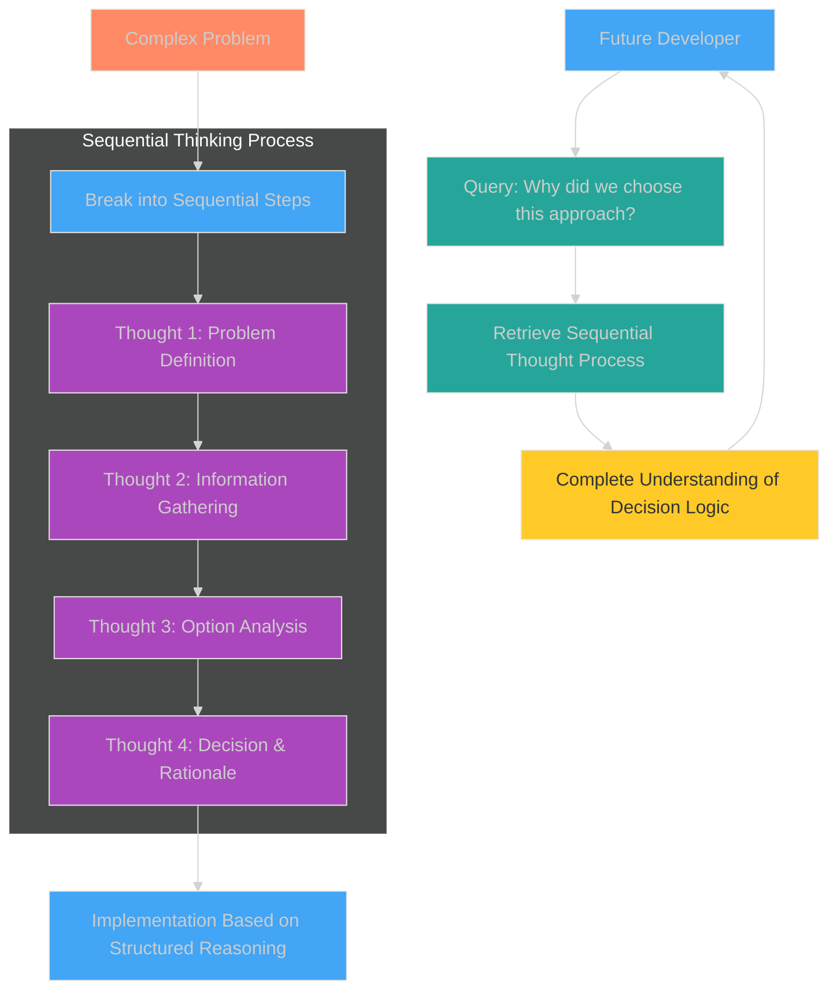
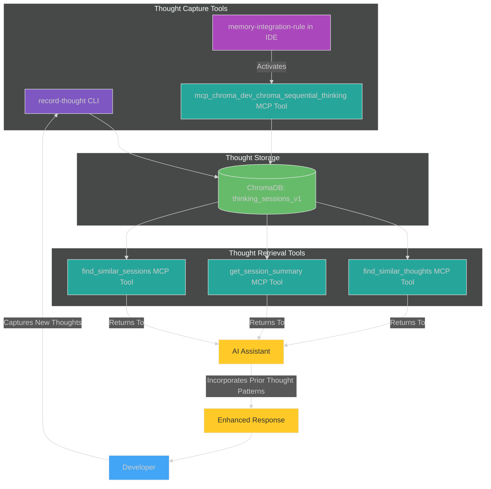
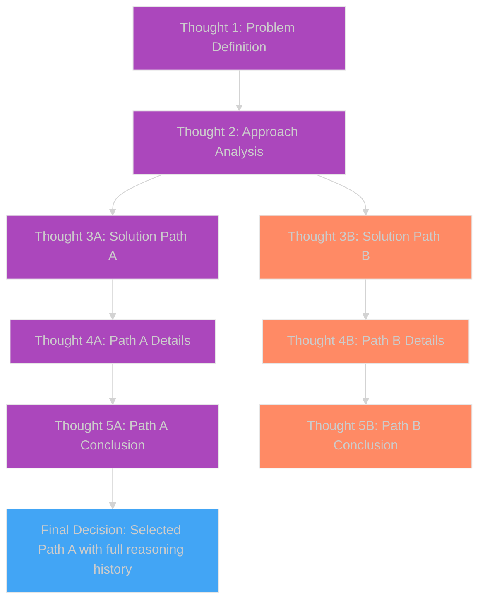
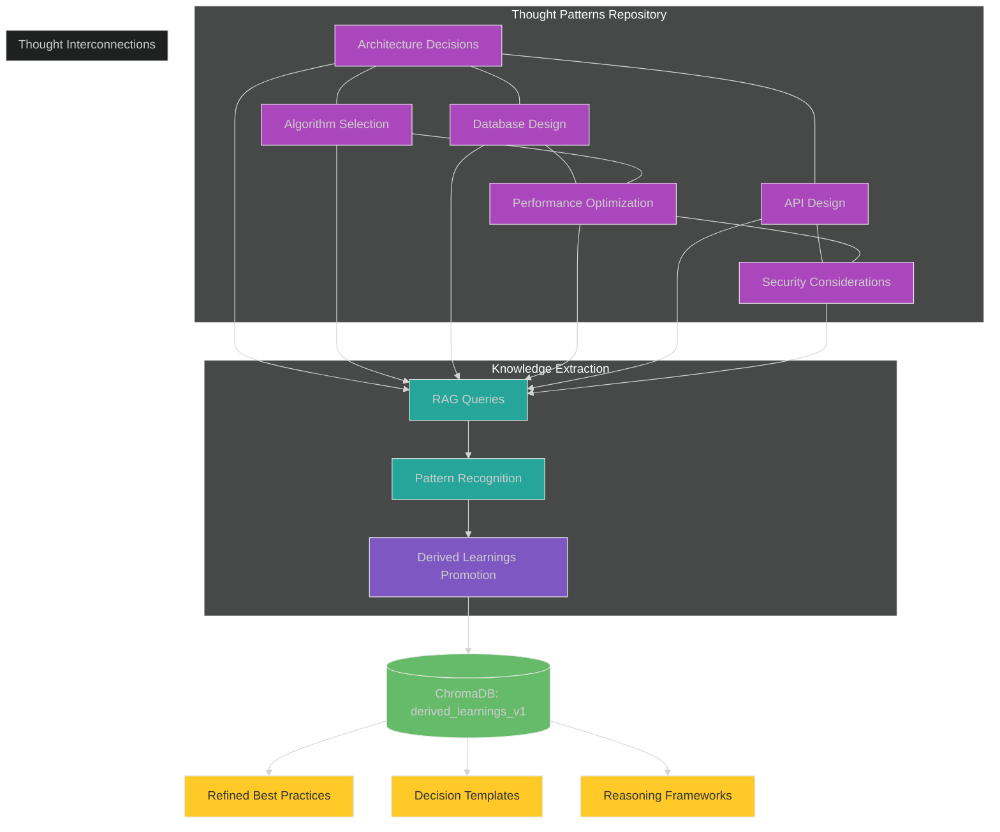
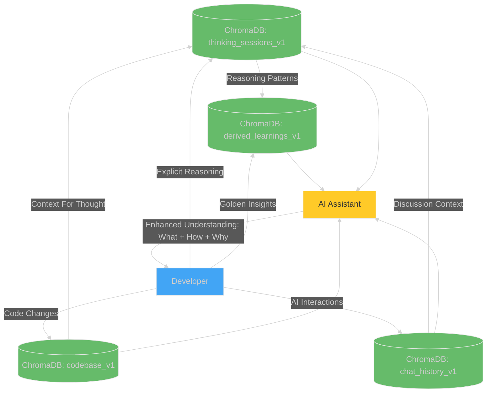
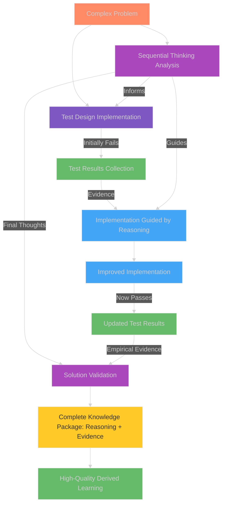

# Sequential Thinking: Capturing and Using Structured Thought Processes

## Introduction: The Power of Explicit Reasoning

Software development involves complex decision-making and problem-solving that often goes undocumented. The reasoning behind architectural choices, algorithm selection, or debugging approaches typically exists only in a developer's mind—until it's forgotten. This creates knowledge gaps that hinder future maintenance, onboarding, and innovation.

The Chroma MCP Server's Sequential Thinking tools transform this implicit reasoning into explicit, structured knowledge that can be preserved, searched, and built upon. This document explains how to:

1. **Capture reasoning** in a structured, sequential format
2. **Store thoughts** in the `thinking_sessions_v1` collection
3. **Retrieve relevant thoughts** when facing similar challenges
4. **Build upon previous thinking** in a coherent, progressive manner
5. **Promote valuable insights** to the curated `derived_learnings_v1` collection

## The Sequential Thinking Concept

Sequential Thinking is a structured approach to capturing complex reasoning processes in discrete, numbered steps that form a coherent chain of thought.



*Fig 1: Sequential Thinking Concept - Breaking complex reasoning into structured steps.*

Unlike traditional documentation or comments, Sequential Thinking:

- Captures the **thought process itself**, not just the outcome
- Maintains the **temporal sequence** of reasoning steps
- Includes **alternatives considered** and why they were rejected
- Preserves the **context** of decisions at the time they were made
- Creates a **searchable knowledge base** of reasoning patterns

## Sequential Thinking Tools and Architecture

The Chroma MCP Server provides dedicated tools for capturing, retrieving, and utilizing sequential thoughts:



*Fig 2: Sequential Thinking Architecture - Tools for capturing and retrieving structured thoughts.*

## Schema: thinking_sessions_v1 Collection

The `thinking_sessions_v1` collection stores sequential thoughts with the following schema:

| Field | Type | Description |
|-------|------|-------------|
| `session_id` | `string` (UUID) | Unique identifier for the thinking session |
| `thought_number` | `integer` | Sequential position in the thought process (1, 2, 3...) |
| `total_thoughts` | `integer` | Total expected number of thoughts in the sequence |
| `thought` | `string` | The content of the thought |
| `timestamp` | `string` (ISO format) | When the thought was recorded |
| `branch_id` | `string` | Optional identifier for alternative thought branches |
| `branch_from_thought` | `integer` | If branching, the parent thought number it branches from |
| `next_thought_needed` | `boolean` | Indicates if more thoughts are expected in this sequence |
| `tags` | `string` | Optional comma-separated tags for categorization |
| `related_code_chunks` | `string` | Optional comma-separated chunk IDs from `codebase_v1` |
| `confidence` | `float` | Confidence level in this thought (0.0-1.0) |

## Detailed Sequential Thinking Workflow

### 1. Starting a New Thinking Session

When facing a complex problem or making an important decision, initiate a new sequential thinking session:

```mermaid
%%{init: {'theme': 'dark'}}%%
sequenceDiagram
    participant D as Developer
    participant CLI as record-thought CLI
    participant DB as ChromaDB
    
    D->>CLI: record-thought "Thought 1 of 4: We need to decide on a database technology for our project. Our requirements are..."
    CLI->>DB: Store in thinking_sessions_v1
    Note over CLI,DB: New session_id generated
    
    D->>CLI: record-thought --session-id <uuid> "Thought 2 of 4: The options we're considering are PostgreSQL, MongoDB, and Redis. Let's analyze each..."
    CLI->>DB: Store with same session_id
    
    D->>CLI: record-thought --session-id <uuid> "Thought 3 of 4: Based on our criteria, the weighted scores are..."
    CLI->>DB: Store with same session_id
    
    D->>CLI: record-thought --session-id <uuid> "Thought 4 of 4: Therefore, we should use PostgreSQL because..."
    CLI->>DB: Store with same session_id
    
    Note over D,DB: Complete thought process preserved with reasoning

    style D fill:#42A5F5,stroke:#E6E6E6,stroke-width:1px
    style CLI fill:#7E57C2,stroke:#E6E6E6,stroke-width:1px
    style DB fill:#66BB6A,stroke:#E6E6E6,stroke-width:1px
```

*Fig 3: Starting a New Thinking Session - Recording a complete thought sequence.*

#### CLI Usage Example

```bash
# First thought (generates a new session_id)
record-thought "Thought 1 of 4: We need to decide on a database technology for our project. The key requirements are high consistency, SQL support, and horizontal scalability."

# Record the session_id returned
export SESSION_ID="3fa85f64-5717-4562-b3fc-2c963f66afa6"

# Subsequent thoughts in the same session
record-thought --session-id $SESSION_ID "Thought 2 of 4: The options we're considering are PostgreSQL, MongoDB, and Redis. PostgreSQL offers ACID compliance and SQL, MongoDB provides document flexibility, and Redis excels at speed."

record-thought --session-id $SESSION_ID "Thought 3 of 4: Analyzing against our requirements: PostgreSQL scores 9/10 for consistency, 10/10 for SQL, 7/10 for scalability. MongoDB scores 7/10, 0/10, 9/10. Redis scores 5/10, 0/10, 10/10."

record-thought --session-id $SESSION_ID "Thought 4 of 4: Therefore, we will use PostgreSQL. While it has lower scalability scores than alternatives, our consistency and SQL requirements are non-negotiable, and we can address scaling with read replicas and connection pooling."
```

### 2. Branching Thought Processes

Sometimes you need to explore alternative approaches. The Sequential Thinking system supports branching:



*Fig 4: Branching Thought Processes - Exploring alternative approaches.*

#### CLI Usage Example for Branching

```bash
# Start with main thought path
record-thought "Thought 1 of 3: We need to optimize database query performance..."
export SESSION_ID="3fa85f64-5717-4562-b3fc-2c963f66afa6"

record-thought --session-id $SESSION_ID "Thought 2 of 3: Initial analysis shows two possible approaches..."

# Create branch A (main path)
record-thought --session-id $SESSION_ID "Thought 3 of 3: Approach A involves indexing these columns..."

# Create branch B (alternative path)
record-thought --session-id $SESSION_ID --branch-id "approach-b" --branch-from-thought 2 "Thought 3 of 3: Approach B involves denormalizing the schema..."
```

### 3. Retrieving and Building on Past Thoughts

The true power of Sequential Thinking emerges when retrieving and building upon past reasoning:

```mermaid
%%{init: {'theme': 'dark'}}%%
sequenceDiagram
    participant D as Developer
    participant AI as AI Assistant
    participant MCP as MCP Tools
    participant DB as ChromaDB
    
    D->>AI: "I'm designing a caching strategy for our API endpoints."
    AI->>MCP: find_similar_thoughts("caching strategy API")
    MCP->>DB: Query thinking_sessions_v1
    DB->>MCP: Return similar thought sessions
    MCP->>AI: Return formatted thought patterns
    
    AI->>D: "I found a relevant thought process from last month where the team analyzed caching options. The sequence went through these considerations: 1) Cache invalidation challenges, 2) TTL strategies, 3) Redis vs. in-memory..."
    
    D->>AI: "That's helpful! Let's adapt that approach for our current needs."
    AI->>D: "Based on the previous thought pattern, let's follow a similar sequence: 1) First, let's identify our cache requirements..."
    
    Note over D,AI: New solution builds on previous reasoning patterns

    style D fill:#42A5F5,stroke:#E6E6E6,stroke-width:1px
    style AI fill:#FFCA28,stroke:#E6E6E6,stroke-width:1px,color:#333333
    style MCP fill:#26A69A,stroke:#E6E6E6,stroke-width:1px
    style DB fill:#66BB6A,stroke:#E6E6E6,stroke-width:1px
```

*Fig 5: Retrieving and Building on Past Thoughts - Leveraging previous reasoning patterns.*

#### MCP Tool Usage Example

When working with an AI assistant in an IDE with MCP integration, the assistant can retrieve relevant thoughts:

```python
# Example of the MCP tool call structure
mcp_chroma_dev_chroma_find_similar_thoughts(
    query="caching strategy for API endpoints with high read volume",
    session_id="",  # Empty to search across all sessions
    n_results=3,
    threshold=0.7,
    include_branches=True
)
```

The `memory-integration-rule` helps the AI assistant recognize when a query relates to previous thoughts and automatically incorporate them into responses.

### 4. Creating a Comprehensive Knowledge Repository

Over time, the Sequential Thinking system builds a rich repository of reasoning patterns:



*Fig 6: Comprehensive Knowledge Repository - Building an interconnected thought library.*

## Integrating Sequential Thinking into Your Workflow

### When to Use Sequential Thinking

Sequential Thinking is especially valuable for:

1. **Architecture Decisions:** Choosing technologies, patterns, or approaches
2. **Complex Troubleshooting:** Working through difficult bugs or performance issues
3. **Algorithm Design:** Analyzing approaches to computational problems
4. **Trade-off Analysis:** Evaluating options with multiple competing factors
5. **Learning New Concepts:** Documenting your understanding as it develops
6. **Code Reviews:** Capturing reasoning about suggested changes

### Best Practices for Effective Sequential Thinking

1. **Number Your Thoughts Explicitly:** Use "Thought 1 of N", "Thought 2 of N" format
2. **Follow a Logical Progression:**
   - Start with problem definition and context
   - Move through information gathering and analysis
   - Explore options with pros/cons
   - Conclude with decisions and next steps
3. **Include Alternatives:** Document paths not taken and why
4. **Link to Relevant Resources:** Code snippets, research papers, or other references
5. **Use Consistent Session IDs:** Maintain thought continuity
6. **Tag for Categorization:** Add descriptive tags for better searchability
7. **Branch When Appropriate:** Create formal thought branches for alternative exploration
8. **Promote Key Insights:** Use the `review-and-promote` CLI to elevate important thought patterns to `derived_learnings_v1`

### Integrating with Other "Second Brain" Components

Sequential Thinking works best as part of the broader "Second Brain" ecosystem:



*Fig 7: Integrated "Second Brain" - How sequential thinking complements other knowledge components.*

## Advanced Features and Customization

### Tracking Confidence in Thoughts

You can assign confidence levels to thoughts, which helps prioritize them during retrieval:

```bash
record-thought --session-id $SESSION_ID --confidence 0.9 "Thought 3 of 4: Based on extensive testing, I'm highly confident that approach X outperforms the alternatives."
```

### Creating Thought Templates

For recurring decision types, consider creating thought templates:

```bash
# Database selection thought template
record-thought "Thought 1 of 4: Database Selection: Requirements Analysis - [List key requirements]"
record-thought --session-id $SESSION_ID "Thought 2 of 4: Database Selection: Options Evaluation - [List options with pros/cons]"
record-thought --session-id $SESSION_ID "Thought 3 of 4: Database Selection: Weighted Scoring - [Show scoring matrix]"
record-thought --session-id $SESSION_ID "Thought 4 of 4: Database Selection: Final Decision - [State decision and justification]"
```

### Integration with Testing Workflow

Sequential Thinking pairs well with test-driven development:

```bash
# Record reasoning about test design
record-thought "Thought 1 of 3: Test Design: For the authentication flow, we need to test the following edge cases..."

# Implement tests based on reasoning
# Run tests (potentially failing)

# Record reasoning about implementation approach
record-thought --session-id $SESSION_ID "Thought 2 of 3: Implementation Approach: To address the test failures, we need to modify the authentication flow to..."

# Implement solution
# Run tests (now passing)

# Record final conclusions
record-thought --session-id $SESSION_ID "Thought 3 of 3: Solution Validation: The tests now pass because our implementation correctly handles the edge cases by..."
```

## Connecting Sequential Thinking with Test-Driven Learning

Sequential Thinking naturally complements the test-driven learning flow described in [Test Result Integration](docs/usage/test_result_integration.md). By combining structured reasoning with empirical test evidence, you create a powerful knowledge acquisition system:



*Fig 8: Sequential Thinking with Test-Driven Learning - Combining reasoning with evidence.*

This integration ensures that:

1. Tests are designed based on clear reasoning
2. Implementation follows a structured thought process
3. Solution validation combines theoretical reasoning with practical evidence
4. Resulting knowledge is both well-reasoned and empirically proven

## Real-World Example: Authentication System Design

Here's a complete example of Sequential Thinking applied to designing an authentication system:

### Thought 1: Problem Definition and Requirements

```bash
record-thought "Thought 1 of 5: Authentication System Design - We need to implement a secure authentication system for our API. Requirements: (1) Support for username/password and OAuth2, (2) MFA capability, (3) Rate limiting for security, (4) Session management with secure token handling, (5) Password policies enforcement."
```

### Thought 2: Security Considerations Analysis

```bash
record-thought --session-id $SESSION_ID "Thought 2 of 5: Security Considerations - Key threats to mitigate: (1) Credential stuffing: need rate limiting and account lockout, (2) Password attacks: need strong hashing (bcrypt/Argon2) and policy enforcement, (3) Session hijacking: need secure, short-lived JWTs with refresh tokens, (4) CSRF attacks: need anti-CSRF tokens or SameSite cookies."
```

### Thought 3: Architecture Options

```bash
record-thought --session-id $SESSION_ID "Thought 3 of 5: Architecture Options - Considering three approaches: 

Option A: Custom auth + JWT 
- Pros: Full control, tailored to our needs
- Cons: Implementation complexity, security responsibility

Option B: Auth0 integration
- Pros: Enterprise-ready, handles complexity, good OAuth support
- Cons: Cost, external dependency, potential performance impact

Option C: Hybrid approach (Custom core + Firebase for OAuth)
- Pros: Balance of control and convenience, lower cost than Auth0
- Cons: Integration complexity, managing multiple systems"
```

### Thought 4: Evaluation and Decision

```bash
record-thought --session-id $SESSION_ID "Thought 4 of 5: Evaluation Decision Matrix - Scoring options against our criteria (1-10 scale):

| Criteria          | Weight | Option A | Option B | Option C |
|-------------------|--------|----------|----------|----------|
| Security          | 0.30   | 7 (2.1)  | 9 (2.7)  | 8 (2.4)  |
| Dev Time          | 0.25   | 5 (1.25) | 9 (2.25) | 7 (1.75) |
| Cost              | 0.20   | 9 (1.8)  | 5 (1.0)  | 7 (1.4)  |
| Customization     | 0.15   | 9 (1.35) | 6 (0.9)  | 8 (1.2)  |
| Maintenance       | 0.10   | 6 (0.6)  | 8 (0.8)  | 7 (0.7)  |
| TOTAL             | 1.00   | 7.1      | 7.65     | 7.45     |

Based on this analysis, Option B (Auth0) scores highest, but Option C (Hybrid) is close behind with better cost/customization balance."
```

### Thought 5: Final Decision and Implementation Plan

```bash
record-thought --session-id $SESSION_ID "Thought 5 of 5: Final Decision - We will implement Option C (Hybrid approach) because:

1. The score differential between Option B and C is small (7.65 vs 7.45)
2. Option C provides better long-term cost control for our expected user scale
3. It still gives us good security while maintaining flexibility for custom flows
4. Our team has some Firebase experience, reducing the learning curve

Implementation will proceed in phases:
1. Set up core authentication service with secure JWT handling
2. Integrate Firebase for OAuth providers
3. Implement MFA leveraging Firebase capabilities
4. Add rate limiting and monitoring at API gateway level
5. Develop admin interface for user management

This approach balances security, development speed, and cost considerations while allowing us to transition to a fully custom solution later if needed."
```

When retrieving this session later, developers would have complete insight into not just what authentication system was chosen, but the full reasoning process, alternatives considered, and evaluation criteria that led to the decision.

## Conclusion: Building a Thinking Culture

Sequential Thinking transforms how knowledge is preserved and shared within a development team. By making reasoning explicit, structured, and searchable, it:

1. **Prevents knowledge loss** when team members leave or memories fade
2. **Accelerates onboarding** by providing insight into why things were built a certain way
3. **Improves decision quality** by encouraging systematic thinking
4. **Enables AI tools** to better understand and assist with complex reasoning
5. **Creates a learning organization** that builds upon its collective wisdom

Start small by capturing reasoning for a few key decisions, then expand as the value becomes apparent. Over time, Sequential Thinking becomes a natural part of your development culture, creating an ever-growing repository of structured reasoning that enhances every aspect of your software development lifecycle.

---

*For detailed API references and additional examples, see the API documentation in this repository.*
