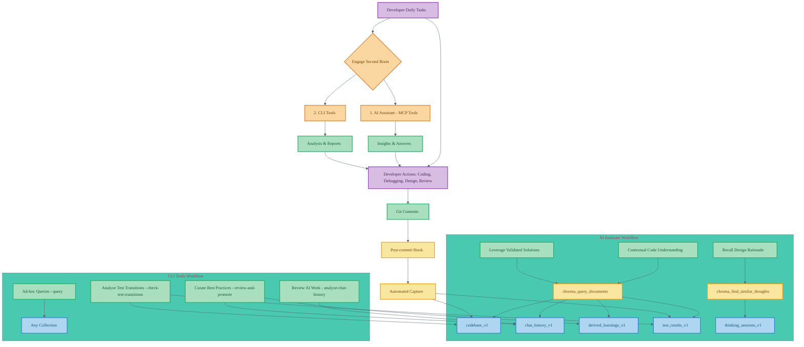

# Leveraging Your "Second Brain": A Daily Integration Guide (Phase 1)

This guide explains how to practically integrate the Phase 1 capabilities of the Chroma MCP Server ecosystem (your "Second Brain") into your daily development workflow. It focuses on using the stored data and correlations from collections like `codebase_v1`, `chat_history_v1`, `derived_learnings_v1`, `thinking_sessions_v1`, and `test_results_v1` *before* the full automation of Phases 2 and 3 (LoRA fine-tuning, automated RL pipelines).

The goal is to make your project's accumulated knowledge an active assistant in your daily tasks. For a conceptual overview, refer to [Getting Started with Your "Second Brain"](../getting_started_second_brain.md) and for the detailed implementation, see the [Local RAG Pipeline Plan v4](../refactoring/local_rag_pipeline_plan_v4.md).

## Core Principle: Active Knowledge Engagement

The "Second Brain" isn't just a passive repository; it's a resource to be actively engaged with. This engagement primarily happens through:

1. **Your AI Assistant:** Leveraging its MCP tools to query the knowledge base.
2. **Dedicated CLI Tools:** For direct analysis, curation, and specific lookups.

## I. Daily Integration via Your AI Assistant (MCP Tools)

Your AI assistant, when integrated with the Chroma MCP Server, becomes your primary interface to the "Second Brain."

### 1. Contextual Code Understanding & Troubleshooting

* **Scenario:** You're looking at a complex piece of code, a bug report, or trying to recall past fixes.
* **Daily Action:** Ask your AI assistant questions like:
  * "What is the history of this function `[function_name]` in `[file_path]`?"
  * "Why was this section of code in `[file_path]` implemented this way?"
  * "We had a bug related to `[error_description/keyword]` in module `[module_name]` a while back. Can you find how we resolved it and what the discussion was?"
  * "Show me discussions and code changes related to `[feature_name]` that also touched upon `[specific_concept_or_variable]`."
* **How it Works:** The AI assistant uses the `chroma_query_documents` MCP tool.
* **Data Queried:**
  * `codebase_v1`: For code context, commit history (via links).
  * `chat_history_v1`: For related discussions, code diffs from those interactions, tool sequences used by the AI during those chats.
  * `derived_learnings_v1`: For curated solutions or patterns relevant to the code or problem.
  * `test_results_v1`: (Indirectly) If a fix was linked to a test transition, that context can be pulled in.
* **Benefit:** Rapidly understand code provenance, rationale behind implementations, and recall past solutions with their full context.

### 2. Recalling Design Rationale & Past Decisions

* **Scenario:** You need to remember the reasoning behind an architectural choice or a complex thought process.
* **Daily Action:** Ask your AI assistant:
  * "What were my main considerations when I recorded thoughts about the `[topic/feature_name]` architecture?"
  * "Can you retrieve my thinking session on `[specific_problem]`?"
* **How it Works:** The AI assistant uses the `chroma_find_similar_thoughts` MCP tool.
* **Data Queried:** `thinking_sessions_v1`.
* **Benefit:** Access detailed reasoning and decision-making processes that are often lost, ensuring consistency and informed future decisions.

### 3. Leveraging Validated Solutions from Test Data

* **Scenario:** A test is failing, or you're encountering an error that seems familiar.
* **Daily Action:** Ask your AI assistant:
  * "This test `[test_name]` is failing. Have we seen similar failures that were fixed, and what was the solution?"
  * "I'm getting `[error_message]`. Can you find any validated fixes or relevant derived learnings?"
* **How it Works:** The AI's `chroma_query_documents` can retrieve information from `chat_history_v1` that is linked to `test_results_v1` (showing a failure-to-success transition) or `derived_learnings_v1` that were promoted based on such evidence.
* **Data Queried:**
  * `test_results_v1`: For patterns of test failures and links to fixes.
  * `chat_history_v1`: For discussions and code changes that resolved tests.
  * `codebase_v1`: For the actual code that constituted the fix.
  * `derived_learnings_v1`: For solutions promoted due to their proven effectiveness in fixing tests or errors.
* **Benefit:** Prioritize solutions that have empirical evidence of working, speeding up debugging and improving fix reliability.

## II. Daily Integration via CLI Tools

These tools are useful for direct interaction, batch analysis, or when you want to curate the knowledge base.

### 1. Reviewing and Understanding Recent AI-Assisted Work

* **Scenario:** You want to review important AI interactions from the previous day or week.
* **Daily/Weekly Action:** Run `chroma-mcp-client analyze-chat-history`.
  * Focus on entries with high confidence scores, significant code impact (based on diffs), or interesting tool sequences.
* **Data Used:** `chat_history_v1` (and its rich metadata).
* **Benefit:** Stay on top of how AI is being used and identify potentially valuable interactions for deeper review or promotion.

### 2. Curating and Promoting Best Practices

* **Scenario:** You've identified a high-quality solution or pattern from a chat interaction or your own work.
* **Daily/Weekly Action:** Use `chroma-mcp-client review-and-promote`.
  * This interactive tool guides you through candidate learnings (often flagged by `analyze-chat-history` or identified manually).
  * Approve and refine entries to be added to `derived_learnings_v1`.
* **Data Used:** `chat_history_v1` (source), `derived_learnings_v1` (destination).
* **Benefit:** Actively build and refine a collection of "golden" solutions and patterns specific to your project, boosting future RAG quality.

### 3. Analyzing Test Transitions for Proven Fixes

* **Scenario:** You want to understand what recent code changes have definitively fixed previously failing tests.
* **Daily/Weekly Action:** Run `chroma-mcp-client check-test-transitions`.
  * This identifies tests that have moved from a failing to a passing state and the associated commits/code changes.
* **Data Used:** `test_results_v1`, `codebase_v1`, Git history.
* **Benefit:** Pinpoint effective fixes backed by test evidence. This information is invaluable for creating robust `derived_learnings_v1` or understanding what makes your code more stable.

### 4. Specific Ad-hoc Queries

* **Scenario:** You need to retrieve very specific information directly.
* **As Needed Action:** Use `chroma-mcp-client query --collection [collection_name] --query_texts "[your_query]"`.
  * Example: `chroma-mcp-client query --collection codebase_v1 --query_texts "database connection retry logic"`
* **Data Used:** Any collection, typically `codebase_v1`, `chat_history_v1`.
* **Benefit:** A direct way to search the raw data when you have a specific target in mind.

## III. Practical Daily Workflow Examples

* **Morning Review:**
    1. Briefly run `chroma-mcp-client analyze-chat-history` to see if any high-value AI interactions from yesterday should be promoted.
    2. Use `chroma-mcp-client review-and-promote` for any candidates.
* **Debugging a New Bug:**
    1. Describe the bug to your AI assistant. Ask it to search `chat_history_v1`, `derived_learnings_v1`, and `test_results_v1` for similar issues, error messages, or related code sections and their fixes.
    2. If the AI finds relevant past fixes, examine the associated code diffs and discussions.
* **Starting a New Feature:**
    1. Use `record-thought` (CLI or via AI if integrated) to outline your approach, potential challenges, and design choices.
    2. Ask your AI assistant: "Based on my recent thoughts about `[feature_name]`, and considering our `codebase_v1` and `derived_learnings_v1`, are there any existing patterns or components I should leverage?"
* **Code Review:**
    1. When reviewing a Pull Request, ask your AI assistant: "Are there any `derived_learnings_v1` entries or past discussions in `chat_history_v1` relevant to the patterns used in this PR for `[specific_component_or_logic]`?"
    2. "Were there any tests related to `[module_affected_by_PR]` that were recently fixed, and does this PR align with those fixes?" (Leveraging `test_results_v1` indirectly).
* **Post-Testing Analysis (especially after fixing flaky tests):**
    1. Run `chroma-mcp-client check-test-transitions` to identify which commits and changes led to tests becoming stable.
    2. Consider promoting the patterns from these successful fixes to `derived_learnings_v1`.

## IV. Preconditions for Effective Daily Use

To get the most out of these Phase 1 capabilities:

1. **Consistent Git Commits:** `codebase_v1` relies on frequent, meaningful commits.
2. **Active AI Assistant Usage:** The richness of `chat_history_v1` depends on using your AI assistant for coding, debugging, and discussion. Ensure the `auto_log_chat` rule is active and correctly configured in your IDE.
3. **Use of Thinking Tools:** Make a habit of using `record-thought` for significant design decisions or complex problem-solving.
4. **Regular Curation:** Dedicate some time (even if brief) to `analyze-chat-history` and `review-and-promote` to build your `derived_learnings_v1`.
5. **Test Suite and Reporting:** Have a decent test suite that outputs JUnit XML for `test_results_v1` to be populated effectively. Utilize the `--auto-capture-workflow` with your test script.
6. **Setup:** Ensure `chroma-mcp-server` is running, `.env` is configured, the Git `post-commit` hook (from `setup-test-workflow`) is active, and CLI tools are accessible.

## V. Bridging the Gap: Potential Enhancements for Daily Work (Phase 1 Focus)

While Phase 1 is already powerful, here are thoughts on making daily integration even smoother without jumping to full LoRA/RL automation:

* **Improved AI Instructions/Rules:**
  * **Current State:** Rules like `auto_log_chat` and `memory-integration-rule` exist. MCP tools like `chroma_query_documents` are somewhat generic.
  * **Improvement Ideas:**
    * Develop more **specialized MCP rules** or enhance existing ones. For example, a "Debug Assist Rule" could more proactively guide the AI to search `test_results_v1` and `chat_history_v1` for similar error patterns when a user pastes an error.
    * Refine prompting strategies for the AI when it uses `chroma_query_documents`. Instead of just a generic query, the prompt could guide it to weigh results from `derived_learnings_v1` more heavily or to specifically look for `TestTransitionEvidence` in `chat_history_v1`.
    * Create a rule that prompts the AI to suggest running `check-test-transitions` after a series of commits aimed at fixing tests.

* **Simpler CLI Aliases or Wrapper Scripts:**
  * **Current State:** CLI commands can be a bit verbose.
  * **Improvement Ideas:** Provide a set of simple shell aliases or wrapper scripts for common daily tasks.
    * e.g., `brain-review-chats` (runs `analyze-chat-history` with common flags).
    * e.g., `brain-promote-learnings` (runs `review-and-promote`).
    * e.g., `brain-find-fix "[error_message]"` (a script that intelligently queries `chat_history_v1`, `derived_learnings_v1`, and `test_results_v1`).

* **Enhanced Feedback in `auto_log_chat`:**
  * **Current State:** Logging is mostly silent.
  * **Improvement Idea:** The `auto_log_chat` could provide a brief confirmation message *to the user* like: "Chat logged. Found 2 related code changes and 1 relevant derived learning during this session. [Link to review them?]" This makes the "Second Brain" feel more active.

* **Basic "Relatedness" Notifications (Non-Intrusive):**
  * **Current State:** Knowledge is pulled on demand.
  * **Improvement Idea (requires more thought on UX):** A very lightweight, non-intrusive notification if the code you *just committed* is highly similar to a high-confidence `derived_learning_v1` entry or resolved a pattern frequently seen in `test_results_v1`. This would be more proactive but needs careful design to avoid annoyance.

* **Better Visualization/Summarization from CLI Tools:**
  * **Current State:** CLI output is text-based.
  * **Improvement Idea:** Enhance CLI tools to provide slightly richer summaries or even generate simple HTML reports for things like `analyze-chat-history` or `check-test-transitions` showing key links and context.

By focusing on these practical integrations and potential small enhancements, the "Second Brain" can become an indispensable part of a developer's toolkit even with just the robust Phase 1 foundation.
