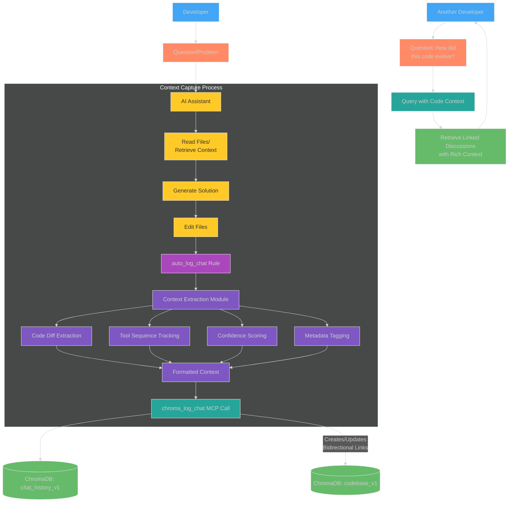
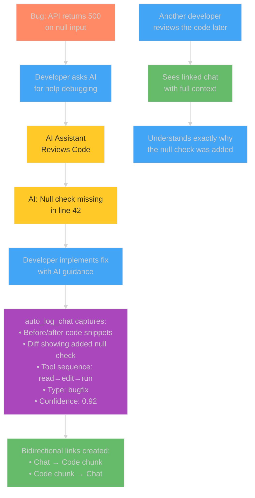
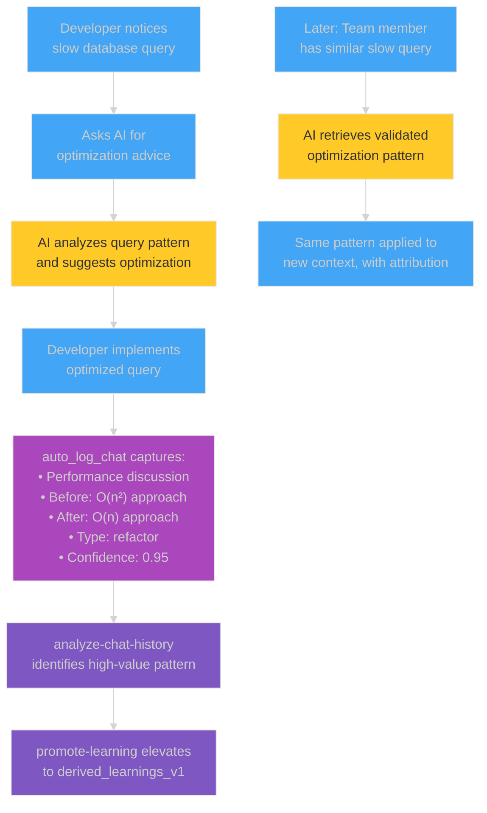

# Enhanced Context Capture: Code and Chat Auto-Logging with Bidirectional Linking

## Introduction: Why Context Matters

In software development, understanding *why* and *how* code changes were made is often as important as the changes themselves. Traditional version control systems like Git track what changed, but they miss critical context:

- The reasoning behind the change
- The discussion that led to the solution
- The alternatives that were considered and rejected
- The sequence of tools and steps used to implement the change
- The confidence level in the chosen approach

The Chroma MCP Server's Enhanced Context Capture system addresses this by automatically logging rich contextual information about every AI-assisted code change, creating bidirectional links between code and discussions, and preserving this valuable metadata for future reference and learning.

## Enhanced Context Capture Architecture

The system consists of several integrated components that work together to create a comprehensive knowledge graph of code changes and their context:



*Fig 1: Enhanced Context Capture Architecture - Automatically collecting and preserving rich context.*

## Key Components of Enhanced Context Capture

### 1. Auto Log Chat Rule

The `auto_log_chat` rule is an IDE integration that automatically activates after every AI assistant response. It instructs the AI to:

1. Summarize the user's prompt and its own response
2. Extract contextual information about any code changes that were made
3. Create bidirectional links between the chat and affected code chunks
4. Log this information to the `chat_history_v1` collection via an MCP call

The rule is designed to work silently in the background, ensuring that no valuable context is lost without requiring manual documentation efforts.

### 2. Context Extraction Module

The `context.py` module in the MCP server provides reusable functions for extracting rich context from interactions:

#### Code Diff Extraction

```python
def extract_code_context(before_content, after_content, file_path):
    """
    Extract meaningful code context from before/after states of a file.
    
    Args:
        before_content: Content of the file before changes
        after_content: Content of the file after changes
        file_path: Path to the modified file
        
    Returns:
        Dict containing:
            - diff: Unified diff of the changes
            - before_snippet: Key snippet from before (surrounding context)
            - after_snippet: Key snippet from after (surrounding context)
            - modification_type: Detected type (refactor/bugfix/feature/docs)
    """
    # Implementation details...
```

This function analyzes the changes made to a file and extracts:

- A unified diff showing exactly what changed
- Key snippets from before and after, with surrounding context
- The type of modification (refactoring, bug fix, feature addition, documentation)

#### Tool Sequence Tracking

```python
def track_tool_sequence(tool_usage_list):
    """
    Analyze a sequence of tool usages to identify patterns.
    
    Args:
        tool_usage_list: List of tool usage dictionaries
        
    Returns:
        Dict containing:
            - sequence_pattern: Simplified pattern (e.g., "read→edit→run")
            - complexity: Estimated complexity of the operation
            - repeated_patterns: Recurring sub-sequences
    """
    # Implementation details...
```

This function identifies patterns in how tools were used, which can indicate the complexity and nature of the changes made.

#### Confidence Scoring

```python
def calculate_confidence_score(context_data):
    """
    Calculate a confidence score for an interaction based on context.
    
    Args:
        context_data: Dictionary of extracted context
        
    Returns:
        Float between 0.0 and 1.0 representing confidence
    """
    # Implementation details...
```

This function computes a confidence score based on factors like:

- The specificity of the question and answer
- The complexity of the code changes
- The presence of test verification
- Similarity to previously successful patterns

### 3. Bidirectional Linking

The Enhanced Context Capture system maintains links in both directions:

1. **Chat to Code:** Each entry in `chat_history_v1` includes references to the affected code chunks via `related_code_chunks` metadata.
2. **Code to Chat:** Each chunk in `codebase_v1` includes references to the chat entries that modified or discussed it via `related_chat_ids` metadata.

This bidirectional linking enables developers to navigate seamlessly between code and discussions, answering questions like:

- "Who changed this code and why?"
- "What other parts of the codebase were affected by this discussion?"
- "What's the history of changes to this function?"

## Enhanced Chat History Schema

The `chat_history_v1` collection has been enhanced with additional fields to store rich context:

| Field | Type | Description |
|-------|------|-------------|
| `session_id` | `string` | Unique identifier for the chat session |
| `timestamp` | `string` | When the interaction occurred |
| `prompt_summary` | `string` | Summary of the user's query |
| `response_summary` | `string` | Summary of the AI's response |
| `involved_entities` | `string` | Comma-separated list of code entities mentioned |
| `raw_prompt_hash` | `string` | Hash of the original prompt |
| `raw_response_hash` | `string` | Hash of the original response |
| `status` | `string` | Current status (e.g., "captured", "analyzed", "promoted_to_learning") |
| `code_context` | `string` | JSON-encoded context including before/after snippets |
| `diff_summary` | `string` | Summary of key changes made |
| `tool_sequence` | `string` | Pattern of tools used (e.g., "read_file→edit_file→run_terminal_cmd") |
| `modification_type` | `string` | Type of change (refactor/bugfix/feature/documentation) |
| `confidence_score` | `float` | AI-assessed value from 0.0-1.0 |
| `related_code_chunks` | `string` | Comma-separated list of chunk IDs from `codebase_v1` |
| `validation_evidence` | `string` | JSON-encoded validation evidence (e.g., test results) |

## The Enhanced Codebase Schema

The `codebase_v1` collection has been enhanced to support bidirectional linking:

| Field | Type | Description |
|-------|------|-------------|
| `file_path` | `string` | Path to the file relative to repository root |
| `chunk_id` | `string` | Unique identifier for this code chunk |
| `commit_sha` | `string` | Git commit hash when this chunk was indexed |
| `content` | `string` | The actual code content |
| `last_modified` | `string` | Timestamp of last modification |
| `language` | `string` | Programming language |
| `chunk_type` | `string` | Type of chunk (function, class, etc.) |
| `related_chat_ids` | `string` | Comma-separated list of chat_history_v1 entry IDs that modified this code |
| `related_test_ids` | `string` | Comma-separated list of test_results_v1 entry IDs relevant to this code |

## A Complete Learning Cycle with Enhanced Context

The enhanced context capture system enables a powerful learning cycle:

```mermaid
%%{init: {'theme': 'dark'}}%%
sequenceDiagram
    actor D as Developer
    participant AI as AI Assistant
    participant L as auto_log_chat
    participant DB as ChromaDB
    participant A as analyze-chat-history
    participant P as promote-learning
    
    D->>AI: "How do I fix this performance issue in our database query?"
    AI->>DB: Query for context from codebase_v1
    DB-->>AI: Return relevant code chunks
    AI->>D: Suggests optimized query with explanation
    
    Note over D,AI: Developer implements the solution
    
    AI->>L: auto_log_chat rule activates
    L->>L: Extract code diff, tool sequence, etc.
    L->>DB: Store in chat_history_v1 with rich context
    L->>DB: Update bidirectional links in codebase_v1
    
    Note over D,AI: Later (scheduled or manual)
    
    A->>DB: Analyze chat_history_v1
    A->>A: Prioritize by confidence_score
    A->>A: Identify high-value interactions
    A->>P: Present candidates for promotion
    
    P->>DB: Promote to derived_learnings_v1
    
    Note over D,AI: Future benefit
    
    D->>AI: "I have a slow query that needs optimization"
    AI->>DB: Query context + derived learnings
    DB-->>AI: Return optimized solution pattern
    AI->>D: Suggest pattern with context from previous success

    style D fill:#42A5F5,stroke:#E6E6E6,stroke-width:1px
    style AI fill:#FFCA28,stroke:#E6E6E6,stroke-width:1px,color:#333333
    style L fill:#AB47BC,stroke:#E6E6E6,stroke-width:1px
    style DB fill:#66BB6A,stroke:#E6E6E6,stroke-width:1px
    style A fill:#7E57C2,stroke:#E6E6E6,stroke-width:1px
    style P fill:#7E57C2,stroke:#E6E6E6,stroke-width:1px
```

*Fig 2: Complete Learning Cycle - From problem to solution to reusable knowledge.*

## Practical Examples: The Enhanced Context in Action

### Example 1: Fixing a Bug with Rich Context



*Fig 3: Bug Fix with Rich Context - Capturing the full story of a bug resolution.*

### Example 2: Refactoring for Performance



*Fig 4: Refactoring with Knowledge Transfer - From one-time fix to reusable pattern.*

## How to Configure and Use Enhanced Context Capture

### Setup Requirements

1. **Chroma MCP Server installed and configured** with your IDE
2. **`auto_log_chat` rule** configured in your IDE settings
3. **ChromaDB collections** set up using `chroma-mcp-client setup-collections`

### Configure Custom Context Extraction

You can customize how context is extracted by editing the `context.py` module:

```python
# Example: Custom scoring factors for different interaction types
CONFIDENCE_WEIGHTS = {
    "bugfix": {
        "test_verified": 0.4,
        "explanation_quality": 0.3,
        "solution_complexity": 0.2,
        "tool_sequence_coherence": 0.1
    },
    "refactor": {
        "performance_improvement": 0.5,
        "complexity_reduction": 0.3,
        "explanation_quality": 0.1,
        "tool_sequence_coherence": 0.1
    },
    # ... other types ...
}
```

### Querying with Enhanced Context

The enriched context enables powerful queries:

```bash
# Find all discussions that modified a specific file
chroma-mcp-client query-chat-history --related-file src/database/query.py

# Find high-confidence interactions (score > 0.9)
chroma-mcp-client query-chat-history --min-confidence 0.9

# Find all bug fixes with their context
chroma-mcp-client query-chat-history --modification-type bugfix

# Find refactorings that used a specific tool sequence
chroma-mcp-client query-chat-history --tool-sequence "read_file→edit_file→run_terminal_cmd" --modification-type refactor
```

### Navigating Bidirectional Links

```bash
# Find all chats that modified a specific code chunk
chroma-mcp-client query-chat-history --code-chunk <chunk_id>

# Find all code chunks modified in a specific chat
chroma-mcp-client query-codebase --chat-id <chat_id>

# Get the full history of a file with all related discussions
chroma-mcp-client get-file-history src/module/file.py
```

## Best Practices for Maximizing Enhanced Context

1. **Ask focused questions** with clear problem statements to improve context quality
2. **Include error messages and expected behavior** in your prompts
3. **Reference specific files and functions** to enhance bidirectional linking
4. **Run tests after changes** to validate solutions (improving confidence scores)
5. **Use the analysis tools regularly:**

   ```bash
   # Run weekly to analyze and prioritize learnings
   chroma-mcp-client analyze-chat-history --prioritize-by confidence --since last-week
   
   # Review and promote high-value learnings
   chroma-mcp-client review-and-promote
   ```

6. **Periodically review the knowledge graph** to identify common patterns:

   ```bash
   # Generate knowledge graph visualization
   chroma-mcp-client generate-knowledge-graph --min-confidence 0.8 --output graph.html
   ```

## Advanced Usage: Custom Context Integrations

### Integration with CI/CD Pipelines

You can integrate the Enhanced Context Capture system with your CI/CD pipeline:

```yaml
# Example GitHub Actions workflow
name: Code Intelligence

on:
  pull_request:
    branches: [ main ]

jobs:
  analyze-context:
    runs-on: ubuntu-latest
    steps:
      - uses: actions/checkout@v2
      - name: Set up Python
        uses: actions/setup-python@v2
        with:
          python-version: '3.10'
      - name: Install dependencies
        run: pip install chroma-mcp-server[client]
      - name: Analyze changed files
        run: |
          chroma-mcp-client analyze-pr-context \
            --pr-number ${{ github.event.pull_request.number }} \
            --repository ${{ github.repository }} \
            --output pr-analysis.md
      - name: Comment on PR
        uses: actions/github-script@v5
        with:
          script: |
            const fs = require('fs');
            const analysis = fs.readFileSync('pr-analysis.md', 'utf8');
            github.rest.issues.createComment({
              issue_number: context.issue.number,
              owner: context.repo.owner,
              repo: context.repo.repo,
              body: analysis
            });
```

### Visual Studio Code Extension Integration

The Enhanced Context Capture system can be integrated with IDE extensions:

```javascript
// Example VS Code extension that adds "View Change Context" command
vscode.commands.registerCommand('extension.viewChangeContext', async () => {
  const editor = vscode.window.activeTextEditor;
  if (!editor) return;
  
  const filePath = editor.document.uri.fsPath;
  const position = editor.selection.active;
  
  // Call the Chroma MCP Server to get context
  const context = await getChangeContext(filePath, position.line);
  
  // Show context in webview panel
  const panel = vscode.window.createWebviewPanel(
    'changeContext',
    'Change Context',
    vscode.ViewColumn.Beside,
    {}
  );
  
  panel.webview.html = formatContextAsHtml(context);
});
```

## Conclusion: From Code Changes to Knowledge Network

The Enhanced Context Capture system transforms isolated code changes and discussions into a rich, interconnected knowledge network. By automatically preserving the context behind every change, it:

1. **Eliminates knowledge silos** by connecting code and discussions
2. **Preserves institutional memory** that would otherwise be lost
3. **Enables AI tools** to provide more relevant, contextual assistance
4. **Accelerates onboarding** by making the "why" of code changes explicit
5. **Identifies valuable patterns** that can be promoted to curated learnings

This creates a virtuous cycle where each interaction enriches the overall knowledge base, making future development more efficient and informed.

---

*For detailed API references and additional examples, see the API documentation in this repository.*
