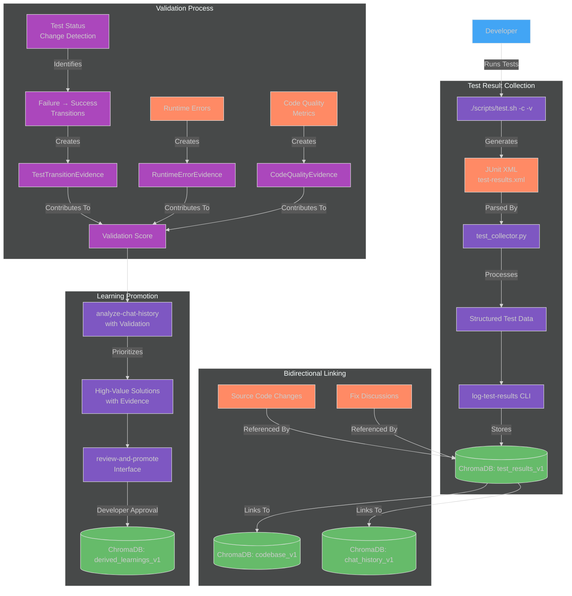
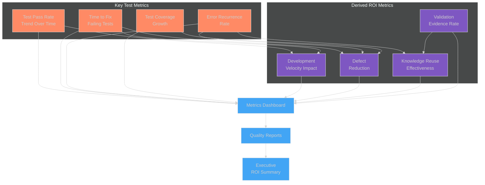

# Test Result Integration: Learning from Failures and Successes

## Introduction: Why Test Results Matter for Learning

Test results provide concrete, empirical evidence of code quality and the effectiveness of solutions. Traditional testing approaches focus on the binary outcome (pass/fail) but miss a critical opportunity: **capturing the knowledge embedded in the journey from test failure to success**.

The Chroma MCP Server's test result integration system transforms test execution from a simple verification mechanism into a powerful knowledge acquisition tool that:

1. **Captures structured data** about test executions including pass/fail status, duration, and error messages
2. **Tracks the transition** from failing tests to passing tests, maintaining the full context of what changed and why
3. **Creates bidirectional links** between tests, code chunks, and discussions that led to fixes
4. **Provides validation evidence** for promoting high-quality solutions to the derived learnings collection
5. **Measures improvement** over time through objective metrics

This document explains how the test result integration system works, how it feeds into the learning promotion workflow, and how to incorporate it into your development process.

## Test Result Capture Architecture

The test result integration system consists of several interconnected components that work together to collect, store, analyze, and utilize test execution data.



*Fig 1: Test Result Integration Architecture - From test execution to validated learning promotion.*

## Schema: Test Results Collection

The `test_results_v1` collection stores detailed information about each test execution. The schema includes:

| Field | Type | Description |
|-------|------|-------------|
| `test_run_id` | `string` (UUID) | Unique identifier for the test execution run |
| `timestamp` | `string` (ISO format) | When the test was executed |
| `test_file` | `string` | Path to the test file that was executed |
| `test_name` | `string` | Name of the specific test case |
| `status` | `string` | "pass", "fail", or "skip" |
| `duration` | `float` | Execution time in seconds |
| `error_message` | `string` | Error message for failures (null for passing tests) |
| `stacktrace` | `string` | Stack trace for debugging (null for passing tests) |
| `related_chat_ids` | `string` | Comma-separated list of chat history entry IDs related to this test |
| `related_code_chunks` | `string` | Comma-separated list of code chunk IDs from `codebase_v1` |
| `commit_hash` | `string` | Git commit hash when the test was run |
| `run_context` | `string` | Additional context about the test run (e.g., "CI", "local") |

## Evidence Types for Validation

The system uses multiple types of evidence to validate and prioritize learnings:

### 1. TestTransitionEvidence

This captures the journey from a failing test to a passing test, providing concrete proof that a solution resolved an issue.

```json
{
  "evidence_type": "TestTransitionEvidence",
  "test_name": "test_connection_timeout_handling",
  "initial_failure": {
    "test_run_id": "3fa85f64-5717-4562-b3fc-2c963f66afa6",
    "timestamp": "2023-06-15T14:30:00Z",
    "error_message": "Connection timeout not properly handled",
    "status": "fail"
  },
  "resolution": {
    "test_run_id": "7fa85f64-5717-4562-b3fc-2c963f66afa9",
    "timestamp": "2023-06-15T16:45:00Z",
    "status": "pass"
  },
  "related_chat_ids": "chat-uuid-1,chat-uuid-2",
  "fix_summary": "Added proper exception handling for connection timeouts",
  "validation_weight": 0.8
}
```

### 2. RuntimeErrorEvidence

This captures errors that occur during actual application execution rather than during testing.

```json
{
  "evidence_type": "RuntimeErrorEvidence",
  "error_type": "ConnectionError",
  "error_message": "Failed to connect to database: timeout",
  "occurrences": 5,
  "first_seen": "2023-06-14T09:15:00Z",
  "last_seen": "2023-06-15T10:30:00Z",
  "resolved": true,
  "resolution_chat_id": "chat-uuid-3",
  "affected_code_chunks": "chunk-uuid-1,chunk-uuid-2",
  "validation_weight": 0.7
}
```

### 3. CodeQualityEvidence

This captures improvements in code quality metrics such as complexity reduction, increased coverage, or performance enhancements.

```json
{
  "evidence_type": "CodeQualityEvidence",
  "metric_type": "cyclomatic_complexity",
  "before_value": 15,
  "after_value": 8,
  "improvement_percentage": 46.7,
  "affected_files": "src/database/connection.py",
  "related_chat_ids": "chat-uuid-4",
  "validation_weight": 0.6
}
```

## The Failure-to-Success Learning Cycle

The most valuable learning opportunities often occur when resolving test failures. The test result integration system is specifically designed to capture this knowledge:

```mermaid
%%{init: {'theme': 'dark'}}%%
sequenceDiagram
    participant D as Developer
    participant T as Test Suite
    participant AI as AI Assistant
    participant R as log-test-results
    participant DB as ChromaDB
    participant A as analyze-chat-history
    participant P as promote-learning
    
    D->>T: Run tests (initial failure)
    T->>R: Generate test-results.xml
    R->>DB: Store failure details
    
    D->>AI: "Why is test_X failing?"
    AI->>DB: Query for context
    AI->>D: Suggest solution
    
    D->>T: Implement fix & re-run tests
    T->>R: Generate updated test-results.xml
    R->>DB: Store success result
    
    R->>DB: Create TestTransitionEvidence
    R->>DB: Update bidirectional links
    
    DB->>A: Regular analysis process
    A->>P: Prioritize by validation score
    P->>DB: Promote to derived_learnings_v1
    
    Note over D,P: Later, another developer benefits
    
    D->>AI: Similar issue question
    AI->>DB: Query with test context
    AI->>D: Return validated solution

    style D fill:#42A5F5,stroke:#E6E6E6,stroke-width:1px
    style T fill:#7E57C2,stroke:#E6E6E6,stroke-width:1px
    style AI fill:#FFCA28,stroke:#E6E6E6,stroke-width:1px,color:#333333
    style R fill:#7E57C2,stroke:#E6E6E6,stroke-width:1px
    style DB fill:#66BB6A,stroke:#E6E6E6,stroke-width:1px
    style A fill:#7E57C2,stroke:#E6E6E6,stroke-width:1px
    style P fill:#7E57C2,stroke:#E6E6E6,stroke-width:1px
```

*Fig 2: Failure-to-Success Learning Cycle - Capturing the knowledge embedded in test resolution.*

### Step-by-Step Workflow

1. **Initial Test Failure**
   - Developer runs tests using the enhanced `./scripts/test.sh -c -v` command
   - A test fails, generating error information in the JUnit XML output
   - The `log-test-results` tool stores this failure in `test_results_v1`
   - Metadata includes links to relevant code chunks and error details

2. **Seeking a Solution**
   - Developer asks AI assistant about the failing test
   - AI retrieves context from `codebase_v1` and previous test results
   - AI suggests potential fixes based on RAG results
   - Developer implements a solution with AI assistance

3. **Validation Through Success**
   - Developer runs tests again using `./scripts/test.sh -c -v`
   - The previously failing test now passes
   - The `log-test-results` tool records this success
   - System detects the transition from failure to success for the same test

4. **Evidence Creation**
   - A `TestTransitionEvidence` record is created automatically
   - This links the initial failure and the subsequent success
   - Links to the chat discussions that led to the solution are preserved
   - A validation score is calculated based on evidence strength

5. **Prioritized Promotion**
   - During regular analysis with `analyze-chat-history`, this interaction is prioritized
   - High validation scores place it at the top of promotion candidates
   - The `review-and-promote` interface shows the validation evidence
   - Developer can quickly review and promote to `derived_learnings_v1`

6. **Knowledge Reuse**
   - Later, another developer encounters a similar test failure
   - AI retrieves the validated solution from `derived_learnings_v1`
   - The empirically proven fix is suggested, saving time and effort

## Getting Started with Test Result Integration

### Prerequisites

- ChromaDB collections set up using `chroma-mcp-client setup-collections`
- Enhanced `test.sh` script that generates JUnit XML output
- Chroma MCP Server with test result integration tools

### Setting Up Test Result Logging

1. **Enable JUnit XML output in your test runner**

   If using pytest (as in the default `test.sh`), ensure it includes the `--junitxml` parameter:

   ```bash
   pytest --junitxml=test-results.xml [other options]
   ```

   The enhanced `test.sh` script already includes this parameter.

2. **Log test results after each test run**

   Automatically or manually run:

   ```bash
   chroma-mcp-client log-test-results --file test-results.xml
   ```

   You can also set up a post-test hook to automatically run this command after each test execution.

### Viewing Test Results and Transitions

To query the test history and transitions:

```bash
# View recent test results
chroma-mcp-client query-tests --limit 10

# Find tests that transitioned from fail to pass
chroma-mcp-client query-test-transitions

# Find all tests related to a specific code file
chroma-mcp-client query-tests --file src/module/file.py

# Find all evidence for a specific test
chroma-mcp-client query-test-evidence --test test_function_name
```

### Incorporating Test Evidence in Learning Promotion

The enhanced `analyze-chat-history` and `review-and-promote` tools automatically incorporate test evidence:

```bash
# Analyze chat history and prioritize by validation score
chroma-mcp-client analyze-chat-history --prioritize-validation

# Review and promote with evidence display
chroma-mcp-client review-and-promote --show-evidence
```

## Validation Scoring System

The system uses a weighted scoring approach to calculate the strength of validation evidence:

```python
def calculate_validation_score(evidence_list):
    """Calculate a validation score based on multiple pieces of evidence."""
    if not evidence_list:
        return 0.0
        
    weights = {
        "TestTransitionEvidence": 0.8,  # Highest weight - concrete proof
        "RuntimeErrorEvidence": 0.7,    # Strong evidence from production
        "CodeQualityEvidence": 0.6      # Measurable improvement
    }
    
    total_score = 0.0
    total_weight = 0.0
    
    for evidence in evidence_list:
        evidence_type = evidence.get("evidence_type")
        if evidence_type in weights:
            evidence_weight = weights[evidence_type]
            evidence_value = evidence.get("validation_weight", 0.5)
            total_score += evidence_weight * evidence_value
            total_weight += evidence_weight
    
    if total_weight == 0:
        return 0.0
        
    return total_score / total_weight
```

This scoring system ensures that:

1. Test transitions (fail → pass) receive the highest weight
2. Runtime error resolutions are valued highly
3. Code quality improvements are recognized
4. Multiple pieces of evidence combine for a stronger overall score

## Advanced Usage: Runtime Error Logging

In addition to test result integration, the system supports logging runtime errors encountered during application execution:

```bash
# Log a runtime error
chroma-mcp-client log-error \
  --error-type ConnectionError \
  --message "Database connection timeout" \
  --file src/database/connection.py \
  --line 42 \
  --stacktrace "Traceback..." \
  --occurred-at "2023-06-15T14:30:00Z"
```

These errors are stored and used as additional validation evidence when reviewing chat interactions that solved the issue.

## Measuring Success: ROI through Test Metrics

The test result integration system provides objective metrics for measuring the ROI of your "Second Brain" implementation:



*Fig 3: ROI Measurement Through Test Metrics - From raw data to business value demonstration.*

The system provides several reports to track improvements:

```bash
# Generate test metric trend report
chroma-mcp-client generate-report --type test-metrics --period last-90-days

# Show knowledge reuse effectiveness
chroma-mcp-client generate-report --type knowledge-reuse

# Generate executive ROI summary
chroma-mcp-client generate-report --type roi-summary
```

## Practical Tips for Maximizing Test-Driven Learning

1. **Run tests frequently** and ensure JUnit XML is generated consistently
2. **Log all test results**, not just when tests fail
3. **Include descriptive messages** in test assertions to provide context
4. **Group related tests** to help establish clear boundaries for evidence
5. **Add test context comments** that explain what's being tested and why
6. **Review validation evidence** regularly when promoting learnings
7. **Monitor the metrics dashboard** to track effectiveness
8. **Encourage documentation** of test-to-fix transitions in chat discussions

## Conclusion

The test result integration system transforms your testing practice from a simple verification tool into a powerful knowledge acquisition mechanism. By systematically capturing the journey from test failure to success, the system provides empirical evidence that enhances the quality and reliability of your derived learnings.

This evidence-based approach ensures that your "Second Brain" doesn't just contain opinions or theoretical best practices, but proven solutions with concrete validation. The result is a continuously improving knowledge base that accelerates development, reduces errors, and provides measurable ROI for your team.

---

*For more details on the implementation and API, see the relevant sections in the code documentation and API reference.*
